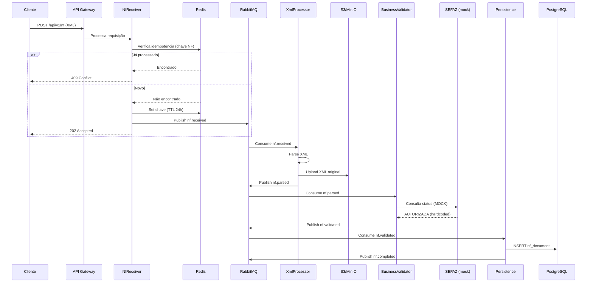

# 00 - Finance Consumer: Visão Geral do Serviço

## Sumário Executivo

O **finance-consumer** é um microsserviço NestJS responsável pelo processamento de Notas Fiscais Eletrônicas (NF-e) brasileiras. Utiliza arquitetura event-driven com RabbitMQ como message broker, PostgreSQL para persistência, Redis para idempotência e cache, e S3/MinIO para armazenamento de XMLs.

**Status atual**: Parcialmente implementado. Fluxo principal funcional, mas com integrações mock (SEFAZ), stubs vazios (email, S3 listener) e gaps de segurança/observabilidade.

---

## Stack Tecnológico

| Camada | Tecnologia | Versão | Propósito |
|--------|------------|--------|-----------|
| Runtime | Node.js | 20.x LTS | Execução |
| Framework | NestJS | 10.4.x | API e DI |
| Linguagem | TypeScript | 5.x strict | Type safety |
| Database | PostgreSQL | 16 | Persistência principal |
| ORM | TypeORM | 0.3.20 | Mapeamento objeto-relacional |
| Message Broker | RabbitMQ | 3.13 | Filas e eventos |
| Cache/Idempotency | Redis | 7.x | Deduplicação e cache |
| Object Storage | S3/MinIO | - | Armazenamento de XMLs |
| Container Runtime | Docker | - | Containerização |
| Orchestration | Kubernetes | - | Deploy e scaling |

---

## Arquitetura de Módulos

```
┌─────────────────────────────────────────────────────────────────────────┐
│                              API GATEWAY                                │
│  ┌─────────────┐  ┌─────────────┐  ┌──────────────┐                    │
│  │ HealthCtrl  │  │   NfCtrl    │  │ ReprocessCtrl│                    │
│  └─────────────┘  └──────┬──────┘  └──────────────┘                    │
└──────────────────────────┼──────────────────────────────────────────────┘
                           │ POST /api/v1/nf
                           ▼
┌─────────────────────────────────────────────────────────────────────────┐
│                            NF-RECEIVER                                  │
│  • Valida payload inicial                                               │
│  • Gera correlationId                                                   │
│  • Verifica idempotência (Redis)                                        │
│  • Publica em queue: nf.received                                        │
└──────────────────────────┬──────────────────────────────────────────────┘
                           │ RabbitMQ
                           ▼
┌─────────────────────────────────────────────────────────────────────────┐
│                          XML-PROCESSOR                                  │
│  • Consome queue: nf.received                                           │
│  • Parse do XML                                                         │
│  • Extrai dados estruturados                                            │
│  • Upload S3 do XML original                                            │
│  • Publica em queue: nf.parsed                                          │
└──────────────────────────┬──────────────────────────────────────────────┘
                           │ RabbitMQ
                           ▼
┌─────────────────────────────────────────────────────────────────────────┐
│                       BUSINESS-VALIDATOR                                │
│  • Consome queue: nf.parsed                                             │
│  • Valida regras de negócio                                             │
│  • Consulta SEFAZ (MOCK - não implementado)                             │
│  • Consulta Receita WS (com circuit breaker)                            │
│  • Publica em queue: nf.validated                                       │
└──────────────────────────┬──────────────────────────────────────────────┘
                           │ RabbitMQ
                           ▼
┌─────────────────────────────────────────────────────────────────────────┐
│                          PERSISTENCE                                    │
│  • Consome queue: nf.validated                                          │
│  • Persiste NF no PostgreSQL                                            │
│  • Atualiza status                                                      │
│  • Emite evento de conclusão                                            │
└─────────────────────────────────────────────────────────────────────────┘
```

---

## Fluxo Principal de Processamento



---

## Módulos e Responsabilidades

### Core Modules

| Módulo | Path | Responsabilidade | Status |
|--------|------|------------------|--------|
| **api-gateway** | `src/modules/api-gateway/` | Controllers REST, DTOs, validação de entrada | ✅ Implementado |
| **nf-receiver** | `src/modules/nf-receiver/` | Recepção, idempotência, enfileiramento | ✅ Implementado |
| **xml-processor** | `src/modules/xml-processor/` | Parse XML, extração de dados, upload S3 | ✅ Implementado |
| **business-validator** | `src/modules/business-validator/` | Validação de negócio, consultas externas | ⚠️ Parcial (SEFAZ mock) |
| **persistence** | `src/modules/persistence/` | Entities, repositories, consumers | ✅ Implementado |

### Infrastructure Modules

| Módulo | Path | Responsabilidade | Status |
|--------|------|------------------|--------|
| **database** | `src/infrastructure/database/` | TypeORM config, migrations | ✅ Implementado |
| **rabbitmq** | `src/infrastructure/rabbitmq/` | Conexão, publicação, consumo | ✅ Implementado |
| **redis** | `src/infrastructure/redis/` | Cache, idempotência | ✅ Implementado |
| **s3** | `src/infrastructure/s3/` | Upload/download de XMLs | ✅ Implementado |
| **observability** | `src/infrastructure/observability/` | Logger, métricas | ⚠️ Incompleto |

### Stubs (Não Implementados)

| Módulo | Path | Propósito | Status |
|--------|------|-----------|--------|
| **email-consumer** | `src/modules/email-consumer/` | Consumir NF-e via IMAP | ❌ Stub vazio |
| **s3-listener** | `src/modules/s3-listener/` | Reagir a uploads S3/SQS | ❌ Stub vazio |

---

## Filas RabbitMQ

| Fila | Producer | Consumer | Dead Letter |
|------|----------|----------|-------------|
| `nf.received` | NfReceiverService | XmlProcessorConsumer | `nf.received.dlq` |
| `nf.parsed` | XmlProcessorConsumer | BusinessValidatorConsumer | `nf.parsed.dlq` |
| `nf.validated` | BusinessValidatorConsumer | PersistenceConsumer | `nf.validated.dlq` |
| `nf.completed` | PersistenceConsumer | (External consumers) | - |

---

## Endpoints REST

| Método | Path | Propósito | Auth |
|--------|------|-----------|------|
| `GET` | `/health/live` | Liveness probe (K8s) | ❌ |
| `GET` | `/health/ready` | Readiness probe (K8s) | ❌ |
| `POST` | `/api/v1/nf` | Enviar NF-e para processamento | ✅ JWT |
| `GET` | `/api/v1/nf/:id` | Consultar status da NF-e | ✅ JWT |
| `POST` | `/api/v1/reprocess/:id` | Reprocessar NF-e com erro | ✅ JWT |

---

## Principais Riscos Identificados

### 🔴 Críticos (Impacto Alto + Probabilidade Alta)

| # | Risco | Impacto | Localização |
|---|-------|---------|-------------|
| 1 | **SEFAZ mock retorna sempre AUTORIZADA** | NF-e inválidas sendo aceitas | `src/modules/business-validator/clients/sefaz.client.ts` |
| 2 | **JWT_SECRET hardcoded em .env.example** | Comprometimento de autenticação | `.env.example`, `src/config/auth.config.ts` |
| 3 | **Secrets K8s com placeholders** | Deploy falha ou inseguro | `k8s/secret.yaml` |
| 4 | **Health checks não verificam dependências** | Pods "healthy" sem conexões reais | `src/modules/api-gateway/controllers/health.controller.ts` |

### 🟠 Altos (Impacto Alto + Probabilidade Média)

| # | Risco | Impacto | Localização |
|---|-------|---------|-------------|
| 5 | **Métricas não exportadas** | Zero observabilidade em produção | `src/infrastructure/observability/` |
| 6 | **Falta validação XSD** | XMLs malformados passam | `src/modules/xml-processor/` |
| 7 | **CORS aberto globalmente** | Vulnerabilidade CSRF | `src/main.ts` |
| 8 | **Falta PodDisruptionBudget** | Downtime em rollouts | `k8s/` |

### 🟡 Médios (Impacto Médio + Probabilidade Variável)

| # | Risco | Impacto | Localização |
|---|-------|---------|-------------|
| 9 | **decimalTransformer pode perder precisão** | Valores financeiros incorretos | `src/modules/persistence/entities/` |
| 10 | **Retry/DLQ duplicado em consumers** | Manutenção difícil, bugs | Todos os consumers |
| 11 | **JwtAuthGuard manual** | Bypass potencial, manutenção | `src/common/guards/jwt-auth.guard.ts` |
| 12 | **Stubs vazios importados** | Erro em runtime se habilitados | `email-consumer`, `s3-listener` |

---

## Dependências Críticas

```
finance-consumer
├── PostgreSQL 16 (obrigatório - persistência)
├── RabbitMQ 3.13 (obrigatório - messaging)
├── Redis 7 (obrigatório - idempotência)
├── S3/MinIO (obrigatório - storage)
├── SEFAZ WS (NÃO IMPLEMENTADO - mock)
└── Receita WS (opcional - consulta CNPJ)
```

---

## Métricas de Código

| Métrica | Valor Estimado | Alvo |
|---------|----------------|------|
| Cobertura de testes | 70-80% | 85%+ |
| Testes de integração | Baixa | Alta |
| Testes E2E | Inexistente | Essencial |
| Complexidade ciclomática média | Moderada | < 10 |
| Duplicação de código | ~15% (consumers) | < 5% |

---

## Próximos Passos Recomendados

1. **Imediato (P0)**: Implementar integração real SEFAZ ou bloquear deploy em produção
2. **Curto prazo (P1)**: Corrigir health checks, exportar métricas, fixar secrets
3. **Médio prazo (P2)**: Refatorar consumers (eliminar duplicação), adicionar validação XSD
4. **Longo prazo (P3)**: Implementar email-consumer e s3-listener ou remover stubs

---

## Documentos Relacionados

- [01-architecture-audit.md](./01-architecture-audit.md) - Análise arquitetural detalhada
- [02-code-quality-audit.md](./02-code-quality-audit.md) - Problemas de código
- [03-infra-audit.md](./03-infra-audit.md) - Infraestrutura e deploy
- [04-refactor-roadmap.md](./04-refactor-roadmap.md) - Roadmap de refatoração
- [05-agent-task-list.md](./05-agent-task-list.md) - Tarefas para AI agents
- [06-development-rules.md](./06-development-rules.md) - Regras de desenvolvimento
- [07-risk-register.md](./07-risk-register.md) - Registro de riscos
- [08-improvement-backlog.md](./08-improvement-backlog.md) - Backlog de melhorias
- [09-ai-agent-instructions.md](./09-ai-agent-instructions.md) - Instruções para AI agents
