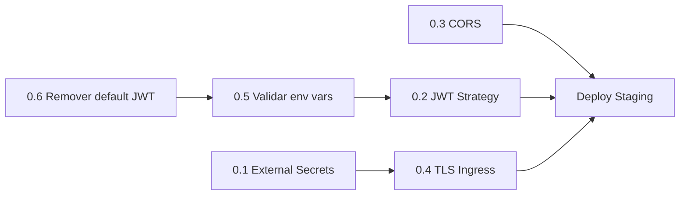
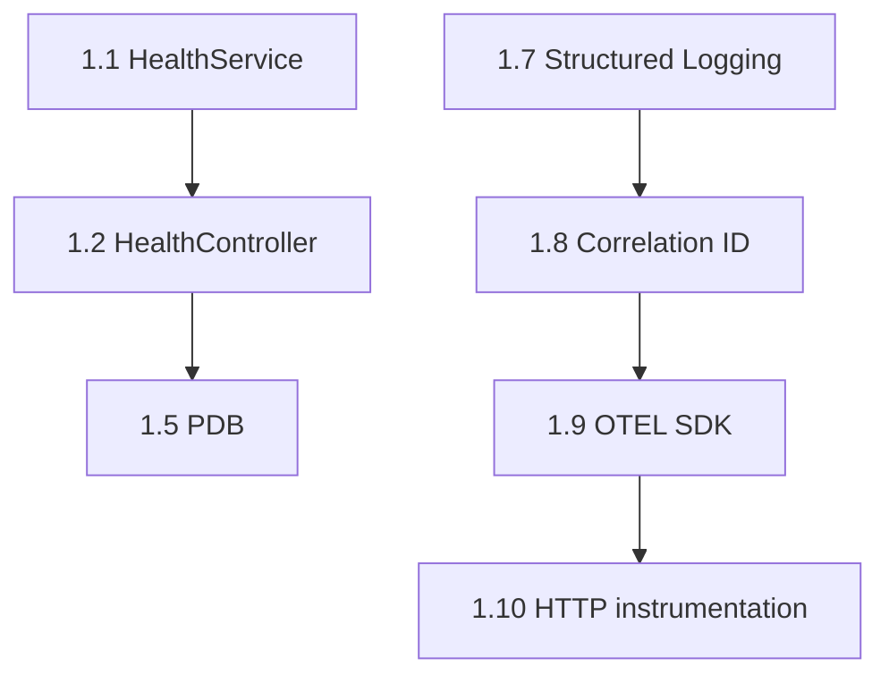
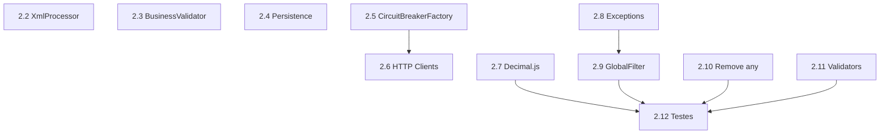
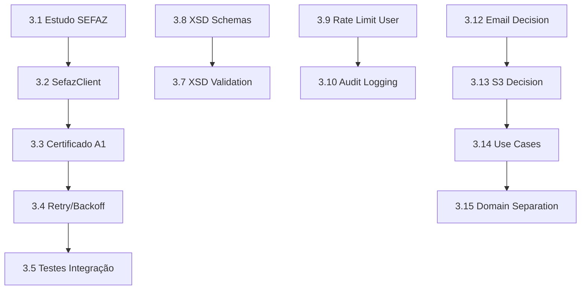
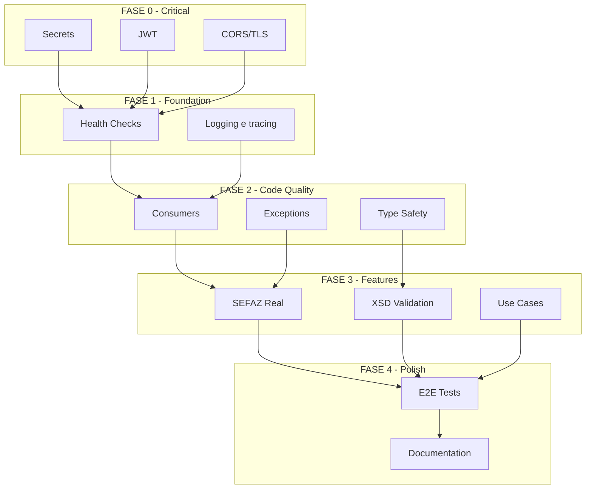

# 04 - Roadmap de Refatoração

## Visão Geral

Este roadmap organiza as refatorações em fases incrementais, considerando dependências, impacto e esforço. Cada fase é independente e entrega valor ao final.

---

## Princípios do Roadmap

1. **Ship incrementally** - Cada fase produz código deployável
2. **Risk first** - Problemas de segurança e produção têm prioridade
3. **Foundation before features** - Infra antes de funcionalidades
4. **Test before refactor** - Cobertura antes de mudar código crítico

---

## Timeline Overview

```
┌─────────────────────────────────────────────────────────────────────────────┐
│                          REFACTORING ROADMAP                                │
├─────────────────────────────────────────────────────────────────────────────┤
│                                                                             │
│  FASE 0       FASE 1         FASE 2          FASE 3         FASE 4        │
│  (1 sprint)   (2 sprints)    (2 sprints)     (3 sprints)    (2 sprints)   │
│                                                                             │
│  ┌─────────┐  ┌───────────┐  ┌────────────┐  ┌───────────┐  ┌──────────┐  │
│  │CRITICAL │  │FOUNDATION │  │ CODE QUAL  │  │ FEATURES  │  │ POLISH   │  │
│  │  FIXES  │──│   & OBS   │──│  & TESTS   │──│   & INT   │──│  & DOCS  │  │
│  └─────────┘  └───────────┘  └────────────┘  └───────────┘  └──────────┘  │
│                                                                             │
│  • Secrets    • Health      • Consumers      • SEFAZ real   • E2E tests   │
│  • JWT fix    • PDB/HPA     • Exceptions     • XSD valid    • Perf tuning │
│  • CORS       • Tracing     • Type safety    • Email stub   • Docs        │
│  • TLS        • Logging     • Decimal.js     • Rate limit   • Runbooks    │
│                                                                             │
└─────────────────────────────────────────────────────────────────────────────┘
```

---

## FASE 0: Critical Security Fixes (Blocker - 1 Sprint)

### Objetivo
Corrigir vulnerabilidades que bloqueiam produção.

### Dependências
Nenhuma - pode iniciar imediatamente.

### Tarefas

| ID | Tarefa | Arquivos | Esforço | Impacto |
|----|--------|----------|---------|---------|
| 0.1 | Migrar secrets para External Secrets | `k8s/secret.yaml` | S | 🔴 Crítico |
| 0.2 | Implementar JWT Strategy com passport | `src/common/guards/jwt-auth.guard.ts`, `src/common/strategies/` | M | 🔴 Crítico |
| 0.3 | Configurar CORS restritivo | `src/main.ts` | S | 🟠 Alto |
| 0.4 | Adicionar TLS no Ingress | `k8s/ingress.yaml` | S | 🔴 Crítico |
| 0.5 | Validar env vars em startup | `src/config/env.validation.ts` | S | 🟠 Alto |
| 0.6 | Remover JWT_SECRET default | `.env.example`, `src/config/auth.config.ts` | S | 🔴 Crítico |

### Definição de Pronto
- [ ] Nenhum secret hardcoded no repo
- [ ] JWT valida issuer, audience, algorithm
- [ ] CORS aceita apenas origens específicas
- [ ] TLS funcional com cert-manager
- [ ] App falha fast se env vars inválidas

### Ordem de Execução



---

## FASE 1: Foundation & Observability (2 Sprints)

### Objetivo
Estabelecer base sólida de infraestrutura e observabilidade.

### Dependências
- FASE 0 completa

### Sprint 1.1 - Health e plataforma K8s

| ID | Tarefa | Arquivos | Esforço | Impacto |
|----|--------|----------|---------|---------|
| 1.1 | Criar HealthService com checks reais | `src/infrastructure/health/health.service.ts` | M | 🔴 Crítico |
| 1.2 | Refatorar HealthController | `src/modules/api-gateway/controllers/health.controller.ts` | S | 🔴 Crítico |
| 1.5 | Adicionar PodDisruptionBudget | `k8s/pdb.yaml` | S | 🟠 Alto |
| 1.6 | Melhorar HPA com memory metrics | `k8s/hpa.yaml` | S | 🟡 Médio |

### Sprint 1.2 - Logging & Tracing

| ID | Tarefa | Arquivos | Esforço | Impacto |
|----|--------|----------|---------|---------|
| 1.7 | Implementar structured logging | `src/infrastructure/observability/logger.service.ts` | M | 🟠 Alto |
| 1.8 | Adicionar correlation ID em todas as camadas | Todos os services | M | 🟠 Alto |
| 1.9 | Configurar OpenTelemetry SDK | `src/infrastructure/observability/tracing.ts` | M | 🟡 Médio |
| 1.10 | Instrumentar HTTP clients | `src/modules/business-validator/clients/` | S | 🟡 Médio |

### Definição de Pronto
- [ ] /health/ready retorna 503 se qualquer dep está down
- [ ] Todos os logs têm correlationId
- [ ] Traces visíveis no Tempo
- [ ] Alertas disparam para: DB down, queue stuck, error rate > 5%

### Ordem de Execução



---

## FASE 2: Code Quality & Tests (2 Sprints)

### Objetivo
Eliminar duplicação, melhorar type safety, aumentar cobertura.

### Dependências
- FASE 1.1 (health checks funcionais para rodar testes)

### Sprint 2.1 - Consumer Refactoring

| ID | Tarefa | Arquivos | Esforço | Impacto |
|----|--------|----------|---------|---------|
| 2.2 | Migrar XmlProcessorConsumer | `src/modules/xml-processor/consumers/` | M | 🟡 Médio |
| 2.3 | Migrar BusinessValidatorConsumer | `src/modules/business-validator/consumers/` | M | 🟡 Médio |
| 2.4 | Migrar PersistenceConsumer | `src/modules/persistence/consumers/` | M | 🟡 Médio |
| 2.5 | Criar CircuitBreakerFactory | `src/infrastructure/http/circuit-breaker.factory.ts` | M | 🟠 Alto |
| 2.6 | Padronizar todos os HTTP clients | `src/modules/business-validator/clients/` | M | 🟠 Alto |

### Sprint 2.2 - Type Safety & Exceptions

| ID | Tarefa | Arquivos | Esforço | Impacto |
|----|--------|----------|---------|---------|
| 2.7 | Implementar Decimal.js | `src/modules/persistence/entities/`, DTOs | M | 🔴 Crítico |
| 2.8 | Criar hierarquia de exceptions | `src/common/exceptions/` | M | 🟠 Alto |
| 2.9 | Refatorar GlobalExceptionFilter | `src/common/filters/global-exception.filter.ts` | M | 🟠 Alto |
| 2.10 | Eliminar `any` types | Todo o código | L | 🟡 Médio |
| 2.11 | Criar validadores customizados (CNPJ, Chave) | `src/common/validators/` | M | 🟡 Médio |
| 2.12 | Adicionar testes unitários faltantes | `*.spec.ts` | L | 🟠 Alto |

### Definição de Pronto
- [ ] Zero duplicação em consumers
- [ ] Todos os HTTP clients usam CircuitBreakerFactory
- [ ] Valores monetários usam Decimal.js
- [ ] Zero `any` types no código
- [ ] Cobertura de testes > 85%

### Ordem de Execução



---

## FASE 3: Features & Integrations (3 Sprints)

### Objetivo
Implementar funcionalidades faltantes e integrações reais.

### Dependências
- FASE 2 (base de código limpa)
- Acesso a ambiente SEFAZ de homologação

### Sprint 3.1 - SEFAZ Integration

| ID | Tarefa | Arquivos | Esforço | Impacto |
|----|--------|----------|---------|---------|
| 3.1 | Estudar API SEFAZ e obter credenciais | Docs | M | - |
| 3.2 | Implementar SefazClient real | `src/modules/business-validator/clients/sefaz.client.ts` | L | 🔴 Crítico |
| 3.3 | Adicionar certificado digital A1 | Config, Secrets | M | 🔴 Crítico |
| 3.4 | Implementar retry com backoff | `sefaz.client.ts` | M | 🟠 Alto |
| 3.5 | Criar testes de integração SEFAZ | `sefaz.client.integration.spec.ts` | L | 🟠 Alto |
| 3.6 | Adicionar feature flag para SEFAZ mock | Config | S | 🟡 Médio |

### Sprint 3.2 - XML Validation & Security

| ID | Tarefa | Arquivos | Esforço | Impacto |
|----|--------|----------|---------|---------|
| 3.7 | Implementar validação XSD | `src/modules/xml-processor/validators/` | L | 🟠 Alto |
| 3.8 | Adicionar schemas XSD (NF-e 4.0) | `schemas/` | S | 🟠 Alto |
| 3.9 | Implementar rate limiting por usuário | `src/common/guards/`, config | M | 🟠 Alto |
| 3.10 | Adicionar audit logging | `src/infrastructure/audit/` | M | 🟡 Médio |
| 3.11 | Implementar token refresh/rotation | Auth services | M | 🟡 Médio |

### Sprint 3.3 - Stubs & Polish

| ID | Tarefa | Arquivos | Esforço | Impacto |
|----|--------|----------|---------|---------|
| 3.12 | Decidir: implementar ou remover email-consumer | - | S | 🟡 Médio |
| 3.13 | Implementar ou remover s3-listener | - | S | 🟡 Médio |
| 3.14 | Criar camada de Use Cases | `src/application/use-cases/` | L | 🟡 Médio |
| 3.15 | Separar Domain Entities de ORM | `src/domain/`, `src/infrastructure/persistence/` | L | 🟡 Médio |
| 3.16 | Implementar cache de consultas frequentes | Redis, services | M | 🟡 Médio |

### Definição de Pronto
- [ ] SEFAZ real funcional em homologação
- [ ] XMLs inválidos rejeitados com erro claro
- [ ] Rate limiting por usuário funcionando
- [ ] Stubs decididos e tratados
- [ ] Audit log de todas as operações sensíveis

### Ordem de Execução



---

## FASE 4: Polish & Documentation (2 Sprints)

### Objetivo
Finalizar testes E2E, performance, documentação.

### Dependências
- FASE 3 completa

### Sprint 4.1 - E2E & Performance

| ID | Tarefa | Arquivos | Esforço | Impacto |
|----|--------|----------|---------|---------|
| 4.1 | Criar testes E2E do pipeline completo | `test/e2e/` | L | 🟠 Alto |
| 4.2 | Load testing com k6 | `load-tests/` | M | 🟠 Alto |
| 4.3 | Identificar e otimizar bottlenecks | Vários | M | 🟡 Médio |
| 4.4 | Tuning de connection pools | Configs | S | 🟡 Médio |
| 4.5 | Implementar graceful shutdown | `src/main.ts`, consumers | M | 🟠 Alto |

### Sprint 4.2 - Documentation & Runbooks

| ID | Tarefa | Arquivos | Esforço | Impacto |
|----|--------|----------|---------|---------|
| 4.6 | Atualizar README com arquitetura real | `README.md` | M | 🟡 Médio |
| 4.7 | Documentar APIs (Swagger/OpenAPI) | Controllers, DTOs | M | 🟡 Médio |
| 4.8 | Criar runbooks de operação | `docs/runbooks/` | L | 🟠 Alto |
| 4.9 | Documentar disaster recovery | `docs/dr/` | M | 🟠 Alto |
| 4.10 | Criar ADRs (Architecture Decision Records) | `docs/adr/` | M | 🟡 Médio |

### Definição de Pronto
- [ ] Testes E2E passando em CI
- [ ] Load test suporta 1000 req/min
- [ ] Graceful shutdown funcional
- [ ] Documentação atualizada
- [ ] Runbooks para todos os alertas

---

## Matriz de Impacto vs Esforço

```
                        IMPACTO
                 Baixo          Alto
           ┌────────────┬────────────┐
     Baixo │            │ 0.3 CORS   │
           │ 1.6 HPA    │ 0.5 Env    │
           │            │ 2.11 Valid │
   E       ├────────────┼────────────┤
   S       │ 3.10 Audit │ 0.1 Secret │
   F       │ 3.16 Cache │ 0.2 JWT    │
   O       │ 4.4 Pools  │ 1.1 Health │
   R       │            │ 2.5 CB     │
   Ç       ├────────────┼────────────┤
   O       │ 3.14 UseCas│ 2.2 XmlPr  │
           │ 3.15 Domain│ 2.7 Decimal│
     Alto  │ 4.10 ADRs  │ 3.2 SEFAZ  │
           │            │ 3.7 XSD    │
           └────────────┴────────────┘
                 
PRIORIDADE: Alto Impacto + Baixo Esforço primeiro
```

---

## Dependências Entre Fases



---

## Riscos do Roadmap

| Risco | Mitigação | Contingência |
|-------|-----------|--------------|
| SEFAZ indisponível para homologação | Iniciar contato com SEFAZ na FASE 0 | Manter mock com feature flag |
| Time não familiarizado com OTEL | Training na FASE 1 | Contratar consultoria |
| Refatoração quebra funcionalidades | Testes antes de refatorar | Feature flags para rollback |
| Estimativas incorretas | Buffer de 20% em cada fase | Repriorizar escopo |
| Dependências externas atrasam | Paralelizar tarefas independentes | Ajustar sequência |

---

## KPIs de Sucesso por Fase

| Fase | KPI | Meta |
|------|-----|------|
| 0 | Vulnerabilidades críticas | 0 |
| 1 | Uptime com health checks reais | 99.9% |
| 1 | Tempo médio para detectar incidente | < 5 min |
| 2 | Cobertura de testes | > 85% |
| 2 | Linhas duplicadas | < 5% |
| 3 | NF-e validadas corretamente | > 99% |
| 3 | Latência P99 validação SEFAZ | < 2s |
| 4 | Throughput sustentável | > 1000 NF-e/min |
| 4 | MTTR (Mean Time To Recovery) | < 15 min |

---

## Estimativa de Recursos

| Fase | Sprints | Devs | Total Pessoa-Sprint |
|------|---------|------|---------------------|
| 0 | 1 | 2 | 2 |
| 1 | 2 | 2 | 4 |
| 2 | 2 | 3 | 6 |
| 3 | 3 | 3 | 9 |
| 4 | 2 | 2 | 4 |
| **Total** | **10** | - | **25** |

Assumindo sprints de 2 semanas: **~5 meses** para execução completa.

---

## Cronograma Sugerido

| Mês | Semanas | Fase | Foco |
|-----|---------|------|------|
| 1 | 1-2 | 0 | Security fixes |
| 1 | 3-4 | 1.1 | Health & K8s |
| 2 | 5-6 | 1.2 | Logging & Tracing |
| 2 | 7-8 | 2.1 | Consumer Refactoring |
| 3 | 9-10 | 2.2 | Type Safety & Exceptions |
| 3 | 11-12 | 3.1 | SEFAZ Integration |
| 4 | 13-14 | 3.2 | XML Validation & Security |
| 4 | 15-16 | 3.3 | Stubs & Polish |
| 5 | 17-18 | 4.1 | E2E & Performance |
| 5 | 19-20 | 4.2 | Documentation |
