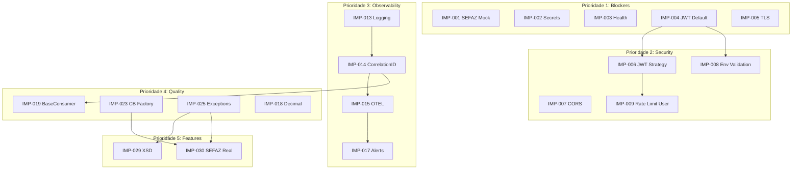

# 08 - Backlog de Melhorias

## Visão Geral

Este backlog contém todas as melhorias identificadas, priorizadas por valor técnico, esforço e dependências. Use este documento para planejar sprints e alocar recursos.

---

## Legenda

**Esforço**:
- **XS**: < 2 horas
- **S**: 2-4 horas
- **M**: 1-2 dias
- **L**: 3-5 dias
- **XL**: 1-2 semanas

**Valor Técnico**:
- ⭐: Baixo - Nice to have
- ⭐⭐: Médio - Melhora qualidade/manutenibilidade
- ⭐⭐⭐: Alto - Resolve problema significativo
- ⭐⭐⭐⭐: Crítico - Bloqueia produção ou segurança

**Categoria**:
- 🔒 Segurança
- 🏗️ Arquitetura
- 🐛 Bug/Fix
- ⚡ Performance
- 📊 Observabilidade
- 🧪 Testes
- 📚 Documentação
- 🔧 Infraestrutura

---

## Backlog Priorizado

### Prioridade 1: Blockers de Produção

| ID | Título | Cat | Esforço | Valor | Deps | Status |
|----|--------|-----|---------|-------|------|--------|
| IMP-001 | Bloquear SEFAZ mock em produção | 🔒 | XS | ⭐⭐⭐⭐ | - | 🔴 TODO |
| IMP-002 | Migrar secrets para External Secrets | 🔧 | M | ⭐⭐⭐⭐ | - | 🔴 TODO |
| IMP-003 | Implementar health checks reais | 🏗️ | M | ⭐⭐⭐⭐ | - | 🔴 TODO |
| IMP-004 | Remover JWT_SECRET default | 🔒 | XS | ⭐⭐⭐⭐ | - | 🔴 TODO |
| IMP-005 | Configurar TLS no Ingress | 🔒 | S | ⭐⭐⭐⭐ | - | 🔴 TODO |

---

### Prioridade 2: Segurança

| ID | Título | Cat | Esforço | Valor | Deps | Status |
|----|--------|-----|---------|-------|------|--------|
| IMP-006 | Migrar para passport-jwt Strategy | 🔒 | M | ⭐⭐⭐ | IMP-004 | 🔴 TODO |
| IMP-007 | Configurar CORS restritivo | 🔒 | S | ⭐⭐⭐ | - | 🔴 TODO |
| IMP-008 | Validação rigorosa de env vars | 🔒 | M | ⭐⭐⭐ | IMP-004 | 🔴 TODO |
| IMP-009 | Rate limiting por usuário | 🔒 | M | ⭐⭐⭐ | IMP-006 | 🔴 TODO |
| IMP-010 | Audit logging de operações | 🔒 | L | ⭐⭐ | - | 🔴 TODO |

---

### Prioridade 3: Observabilidade

| ID | Título | Cat | Esforço | Valor | Deps | Status |
|----|--------|-----|---------|-------|------|--------|
| IMP-013 | Implementar structured logging | 📊 | M | ⭐⭐⭐ | - | 🔴 TODO |
| IMP-014 | Adicionar correlation ID | 📊 | M | ⭐⭐⭐ | IMP-013 | 🔴 TODO |
| IMP-015 | Configurar OpenTelemetry | 📊 | L | ⭐⭐ | IMP-014 | 🔴 TODO |
| IMP-017 | Configurar alertas críticos | 📊 | M | ⭐⭐⭐ | IMP-015 | 🔴 TODO |

---

### Prioridade 4: Qualidade de Código

| ID | Título | Cat | Esforço | Valor | Deps | Status |
|----|--------|-----|---------|-------|------|--------|
| IMP-018 | Implementar Decimal.js | 🐛 | M | ⭐⭐⭐ | - | 🔴 TODO |
| IMP-019 | Criar BaseConsumer abstrato | 🏗️ | L | ⭐⭐⭐ | IMP-014 | 🔴 TODO |
| IMP-020 | Migrar XmlProcessorConsumer | 🏗️ | M | ⭐⭐ | IMP-019 | 🔴 TODO |
| IMP-021 | Migrar BusinessValidatorConsumer | 🏗️ | M | ⭐⭐ | IMP-019 | 🔴 TODO |
| IMP-022 | Migrar PersistenceConsumer | 🏗️ | M | ⭐⭐ | IMP-019 | 🔴 TODO |
| IMP-023 | Criar CircuitBreakerFactory | 🏗️ | M | ⭐⭐⭐ | - | 🔴 TODO |
| IMP-024 | Padronizar HTTP clients | 🏗️ | M | ⭐⭐ | IMP-023 | 🔴 TODO |
| IMP-025 | Criar hierarquia de exceptions | 🏗️ | M | ⭐⭐⭐ | - | 🔴 TODO |
| IMP-026 | Refatorar GlobalExceptionFilter | 🏗️ | M | ⭐⭐ | IMP-025 | 🔴 TODO |
| IMP-027 | Eliminar any types | 🏗️ | L | ⭐⭐ | IMP-018, IMP-025 | 🔴 TODO |
| IMP-028 | Criar validadores customizados | 🏗️ | M | ⭐⭐ | - | 🔴 TODO |

---

### Prioridade 5: Funcionalidades

| ID | Título | Cat | Esforço | Valor | Deps | Status |
|----|--------|-----|---------|-------|------|--------|
| IMP-029 | Implementar validação XSD | 🐛 | L | ⭐⭐⭐ | IMP-025 | 🔴 TODO |
| IMP-030 | Implementar SEFAZ real | 🏗️ | XL | ⭐⭐⭐⭐ | IMP-023, IMP-025 | 🔴 TODO |
| IMP-031 | Criar camada de Use Cases | 🏗️ | L | ⭐⭐ | IMP-025 | 🔴 TODO |
| IMP-032 | Separar Domain de ORM entities | 🏗️ | XL | ⭐⭐ | IMP-031 | 🔴 TODO |
| IMP-033 | Decidir sobre email-consumer | 🏗️ | S | ⭐⭐ | - | 🔴 TODO |
| IMP-034 | Decidir sobre s3-listener | 🏗️ | S | ⭐⭐ | - | 🔴 TODO |

---

### Prioridade 6: Infraestrutura

| ID | Título | Cat | Esforço | Valor | Deps | Status |
|----|--------|-----|---------|-------|------|--------|
| IMP-035 | Adicionar PodDisruptionBudget | 🔧 | XS | ⭐⭐⭐ | - | 🔴 TODO |
| IMP-036 | Melhorar HPA com memory metrics | 🔧 | S | ⭐⭐ | - | 🔴 TODO |
| IMP-037 | Otimizar Dockerfile (multi-stage) | 🔧 | M | ⭐⭐ | - | 🔴 TODO |
| IMP-038 | Adicionar security scan no CI | 🔧 | M | ⭐⭐⭐ | - | 🔴 TODO |
| IMP-039 | Adicionar integration tests no CI | 🔧 | M | ⭐⭐⭐ | - | 🔴 TODO |
| IMP-040 | Configurar cache de Docker layers | 🔧 | S | ⭐ | - | 🔴 TODO |

---

### Prioridade 7: Testes

| ID | Título | Cat | Esforço | Valor | Deps | Status |
|----|--------|-----|---------|-------|------|--------|
| IMP-041 | Aumentar cobertura para 85% | 🧪 | L | ⭐⭐⭐ | - | 🔴 TODO |
| IMP-042 | Criar testes de integração | 🧪 | L | ⭐⭐⭐ | - | 🔴 TODO |
| IMP-043 | Criar testes E2E do pipeline | 🧪 | XL | ⭐⭐⭐ | IMP-030 | 🔴 TODO |
| IMP-044 | Implementar load testing com k6 | 🧪 | M | ⭐⭐ | - | 🔴 TODO |
| IMP-045 | Criar testes de smoke | 🧪 | M | ⭐⭐ | - | 🔴 TODO |

---

### Prioridade 8: Documentação

| ID | Título | Cat | Esforço | Valor | Deps | Status |
|----|--------|-----|---------|-------|------|--------|
| IMP-046 | Atualizar README | 📚 | M | ⭐⭐ | - | 🔴 TODO |
| IMP-047 | Documentar APIs (Swagger) | 📚 | M | ⭐⭐ | - | 🔴 TODO |
| IMP-048 | Criar runbooks de operação | 📚 | L | ⭐⭐⭐ | IMP-017 | 🔴 TODO |
| IMP-049 | Documentar disaster recovery | 📚 | M | ⭐⭐ | - | 🔴 TODO |
| IMP-050 | Criar ADRs | 📚 | M | ⭐⭐ | - | 🔴 TODO |

---

## Detalhamento de Itens Selecionados

### IMP-001: Bloquear SEFAZ Mock em Produção

**Descrição**:
Adicionar feature flag `SEFAZ_MOCK_ENABLED` que permite usar mock apenas em development/staging. Em production, se flag estiver true ou SEFAZ real não configurado, aplicação não inicia.

**Arquivos**:
- `src/config/sefaz.config.ts`
- `src/modules/business-validator/clients/sefaz.client.ts`
- `.env.example`

**Implementação**:
```typescript
// src/config/sefaz.config.ts
export const sefazConfig = registerAs('sefaz', () => {
  const isMockEnabled = process.env.SEFAZ_MOCK_ENABLED === 'true';
  const isProduction = process.env.NODE_ENV === 'production';
  
  if (isProduction && isMockEnabled) {
    throw new Error('SEFAZ_MOCK_ENABLED cannot be true in production');
  }
  
  if (isProduction && !process.env.SEFAZ_CERTIFICATE_PATH) {
    throw new Error('SEFAZ_CERTIFICATE_PATH is required in production');
  }
  
  return {
    mockEnabled: isMockEnabled,
    certificatePath: process.env.SEFAZ_CERTIFICATE_PATH,
    endpoint: process.env.SEFAZ_ENDPOINT,
  };
});
```

**Critérios de Aceite**:
- [ ] App não inicia em production com SEFAZ_MOCK_ENABLED=true
- [ ] App não inicia em production sem certificado configurado
- [ ] Em development, mock funciona normalmente
- [ ] Logs indicam claramente se mock está ativo

---

### IMP-003: Implementar Health Checks Reais

**Descrição**:
O endpoint `/health/ready` deve verificar conexão real com PostgreSQL, Redis e RabbitMQ. Retornar 503 se qualquer dependência falhar.

**Arquivos**:
- `src/infrastructure/health/health.service.ts` (criar)
- `src/infrastructure/health/health.module.ts` (criar)
- `src/modules/api-gateway/controllers/health.controller.ts` (refatorar)

**Implementação**:
```typescript
// src/infrastructure/health/health.service.ts
@Injectable()
export class HealthService {
  constructor(
    private readonly dataSource: DataSource,
    @InjectRedis() private readonly redis: Redis,
    private readonly rabbitMq: RabbitMqService,
  ) {}

  async checkReadiness(): Promise<HealthResult> {
    const checks: HealthCheck[] = [
      { name: 'database', check: () => this.checkDatabase() },
      { name: 'redis', check: () => this.checkRedis() },
      { name: 'rabbitmq', check: () => this.checkRabbitMq() },
    ];

    const results = await Promise.allSettled(
      checks.map(async (c) => ({
        name: c.name,
        status: await this.executeCheck(c.check),
      })),
    );

    const checksResult = results.map((r) =>
      r.status === 'fulfilled' ? r.value : { name: 'unknown', status: 'down' },
    );

    const healthy = checksResult.every((c) => c.status === 'up');

    return { healthy, checks: checksResult };
  }

  private async checkDatabase(): Promise<void> {
    await this.dataSource.query('SELECT 1');
  }

  private async checkRedis(): Promise<void> {
    const pong = await this.redis.ping();
    if (pong !== 'PONG') throw new Error('Redis ping failed');
  }

  private async checkRabbitMq(): Promise<void> {
    if (!this.rabbitMq.isConnected()) {
      throw new Error('RabbitMQ not connected');
    }
  }
}
```

**Critérios de Aceite**:
- [ ] /health/ready retorna 200 se todas as deps estão up
- [ ] /health/ready retorna 503 se qualquer dep está down
- [ ] Response body inclui status de cada dependência
- [ ] Timeout de 5s para cada check
- [ ] Kubernetes marca pod como not ready quando 503

---

### IMP-019: Criar BaseConsumer Abstrato

**Descrição**:
Classe base que encapsula lógica comum de todos os RabbitMQ consumers: parsing, retry com backoff, DLQ e logging.

**Arquivos**:
- `src/infrastructure/rabbitmq/base-consumer.ts` (criar)
- `src/infrastructure/rabbitmq/interfaces/consumer.interface.ts` (criar)

**Implementação**:
```typescript
// src/infrastructure/rabbitmq/base-consumer.ts
@Injectable()
export abstract class BaseConsumer<T> implements OnModuleInit {
  protected abstract readonly queueName: string;
  protected abstract readonly dlqName: string;
  protected readonly maxRetries: number = 3;
  protected readonly backoffMultiplier: number = 2;
  protected readonly initialDelay: number = 1000;

  constructor(
    protected readonly channel: Channel,
    protected readonly logger: LoggerService,
  ) {}

  protected abstract process(data: T, context: MessageContext): Promise<void>;
  protected abstract isRetryable(error: Error): boolean;

  async handleMessage(msg: ConsumeMessage): Promise<void> {
    const correlationId = msg.properties.correlationId || uuidv4();
    const startTime = Date.now();
    const context: MessageContext = { correlationId, startTime };

    try {
      const data = this.parseMessage<T>(msg);
      await this.process(data, context);
      this.channel.ack(msg);
      this.recordSuccess(context);
    } catch (error) {
      await this.handleError(msg, error, context);
    }
  }

  private async handleError(
    msg: ConsumeMessage,
    error: Error,
    context: MessageContext,
  ): Promise<void> {
    const retryCount = this.getRetryCount(msg);
    this.logger.error(`Error processing message`, { error, context, retryCount });

    if (this.isRetryable(error) && retryCount < this.maxRetries) {
      await this.retryWithBackoff(msg, retryCount);
    } else {
      await this.sendToDlq(msg, error);
    }
    this.recordError(error, context);
  }

  private async retryWithBackoff(msg: ConsumeMessage, retryCount: number): Promise<void> {
    const delay = this.initialDelay * Math.pow(this.backoffMultiplier, retryCount);
    const content = msg.content;
    const properties = {
      ...msg.properties,
      headers: { ...msg.properties.headers, 'x-retry-count': retryCount + 1 },
    };

    setTimeout(() => {
      this.channel.sendToQueue(this.queueName, content, properties);
    }, delay);

    this.channel.ack(msg);
  }
}
```

**Critérios de Aceite**:
- [ ] BaseConsumer é classe abstrata genérica
- [ ] Retry com exponential backoff implementado
- [ ] DLQ funciona corretamente
- [ ] Logging com correlationId
- [ ] Testes unitários completos

---

### IMP-030: Implementar SEFAZ Real

**Descrição**:
Substituir mock do SefazClient por integração real com webservice da SEFAZ. Usar certificado digital A1 para autenticação.

**Arquivos**:
- `src/modules/business-validator/clients/sefaz.client.ts` (refatorar)
- `src/config/sefaz.config.ts` (criar)
- `src/infrastructure/http/soap.client.ts` (criar)

**Pré-requisitos**:
- Acesso a ambiente de homologação SEFAZ
- Certificado digital A1 válido
- Documentação da API SEFAZ

**Critérios de Aceite**:
- [ ] Conexão SOAP com certificado A1
- [ ] Consulta de status de NF-e (NFeConsulta)
- [ ] Circuit breaker com opossum
- [ ] Retry para erros transientes
- [ ] Logging de requests/responses (sem dados sensíveis)
- [ ] Feature flag para alternar entre mock e real
- [ ] Testes de integração com SEFAZ homologação

---

## Estimativa de Sprints

### Sprint 1: Security Critical (Bloqueadores)

| Item | Esforço | Responsável |
|------|---------|-------------|
| IMP-001 | XS | Dev 1 |
| IMP-002 | M | Dev 2 |
| IMP-003 | M | Dev 1 |
| IMP-004 | XS | Dev 2 |
| IMP-005 | S | Dev 2 |
| IMP-007 | S | Dev 1 |
| **Total** | ~4 dias | 2 devs |

### Sprint 2: Security + Observability

| Item | Esforço | Responsável |
|------|---------|-------------|
| IMP-006 | M | Dev 1 |
| IMP-008 | M | Dev 2 |
| IMP-013 | M | Dev 2 |
| IMP-035 | XS | Dev 2 |
| **Total** | ~5 dias | 2 devs |

### Sprint 3: Observability + Quality

| Item | Esforço | Responsável |
|------|---------|-------------|
| IMP-014 | M | Dev 1 |
| IMP-017 | M | Dev 2 |
| IMP-018 | M | Dev 1 |
| IMP-025 | M | Dev 2 |
| IMP-023 | M | Dev 1 |
| **Total** | ~5 dias | 2 devs |

### Sprint 4: Code Quality

| Item | Esforço | Responsável |
|------|---------|-------------|
| IMP-019 | L | Dev 1 |
| IMP-020 | M | Dev 2 |
| IMP-021 | M | Dev 2 |
| IMP-022 | M | Dev 2 |
| IMP-024 | M | Dev 1 |
| IMP-026 | M | Dev 1 |
| **Total** | ~6 dias | 2 devs |

### Sprint 5-6: Features (SEFAZ)

| Item | Esforço | Responsável |
|------|---------|-------------|
| IMP-029 | L | Dev 1 |
| IMP-030 | XL | Dev 1 + Dev 2 |
| IMP-009 | M | Dev 2 |
| **Total** | ~10 dias | 2 devs |

### Sprint 7-8: Tests + Polish

| Item | Esforço | Responsável |
|------|---------|-------------|
| IMP-041 | L | Dev 1 |
| IMP-042 | L | Dev 2 |
| IMP-043 | XL | Dev 1 + Dev 2 |
| IMP-044 | M | Dev 1 |
| **Total** | ~8 dias | 2 devs |

---

## Dependências Visuais



---

## Métricas de Progresso

| Métrica | Início | Meta | Atual |
|---------|--------|------|-------|
| Itens Críticos Abertos | 5 | 0 | 5 |
| Itens Altos Abertos | 10 | 0 | 10 |
| Cobertura de Testes | 70% | 85% | 70% |
| Vulnerabilidades Críticas | 4 | 0 | 4 |
| Débito Técnico (dias) | ~40 | ~10 | ~40 |
