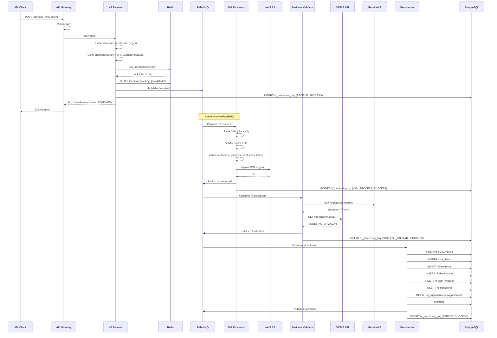
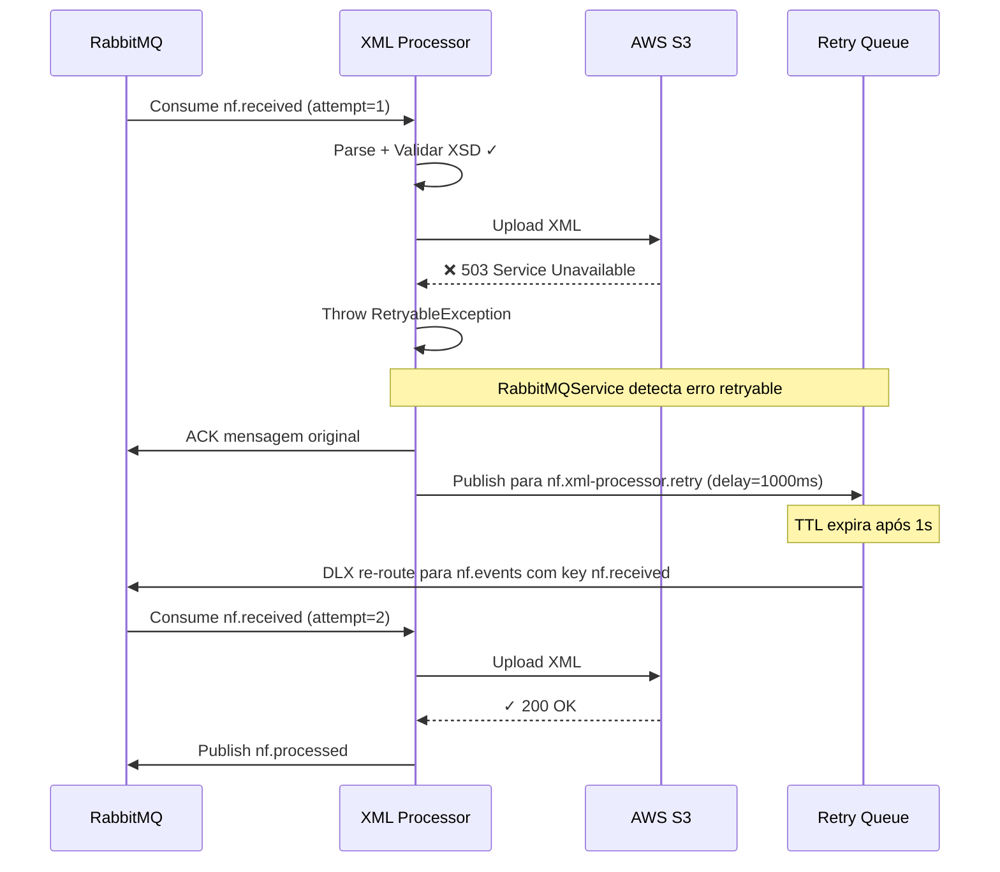
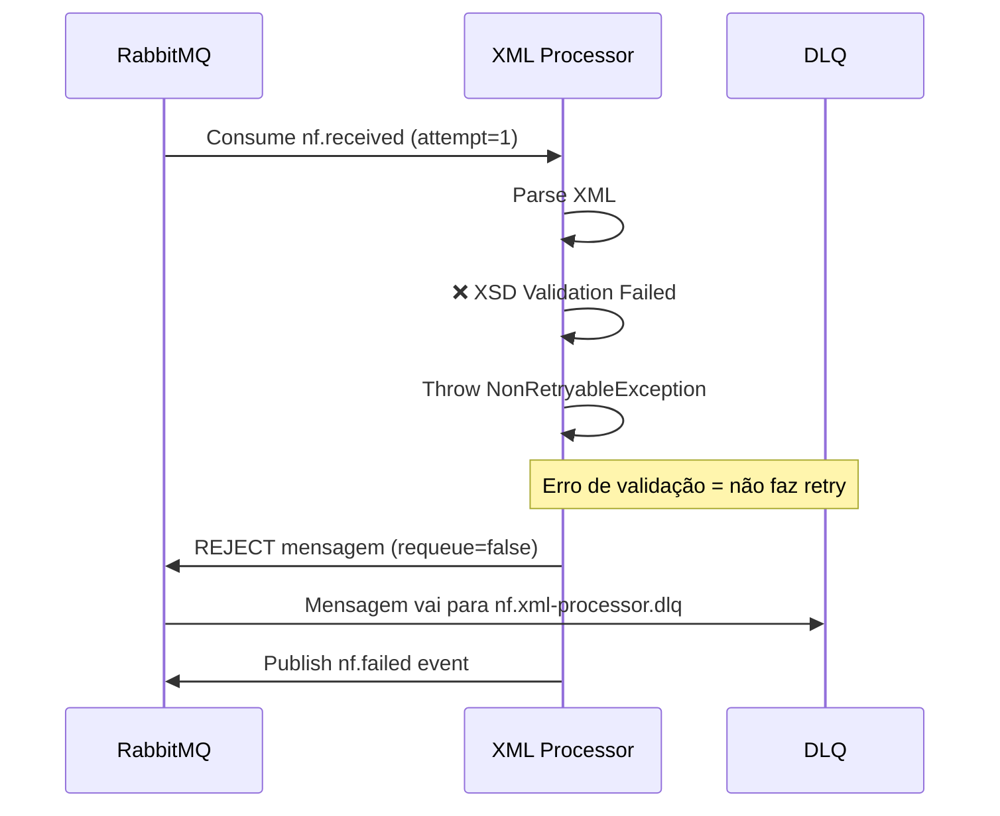
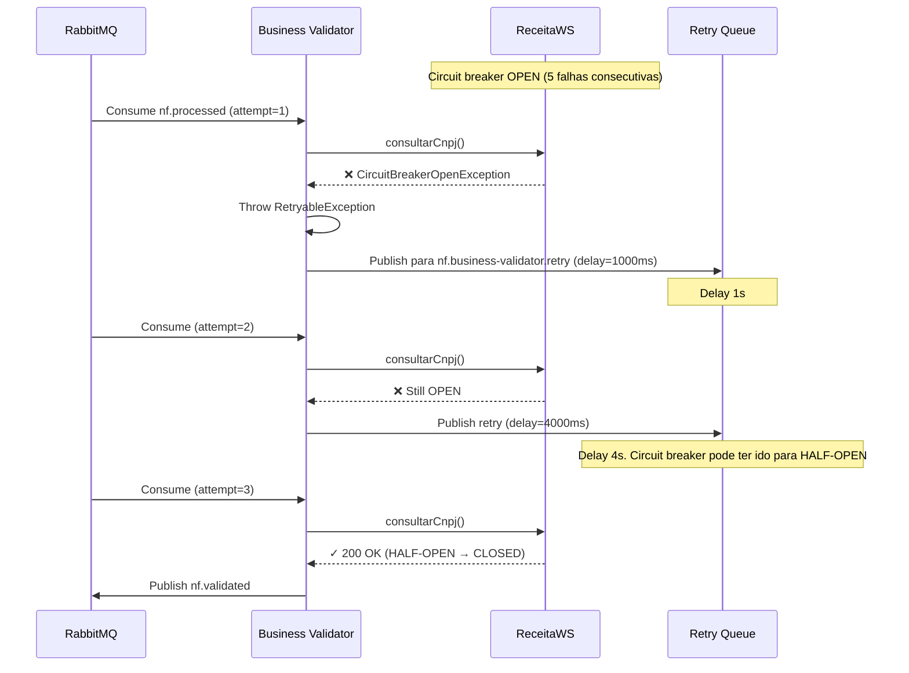
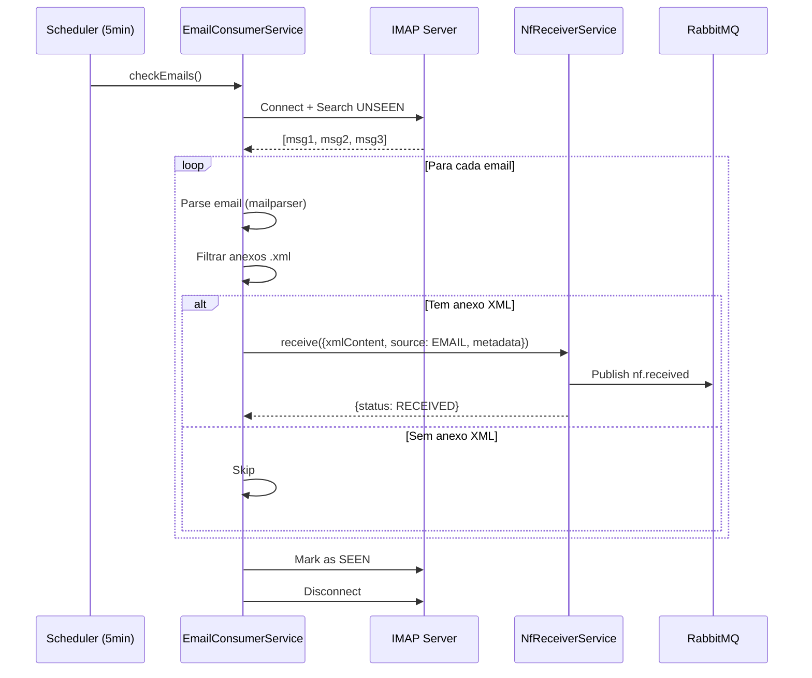
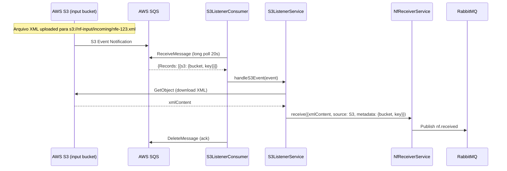

# FLOWS.md — Fluxos de Processamento, Erro, Idempotência e DLQ

## 1. Fluxo Completo de Processamento (Happy Path)

### 1.1 Diagrama de Sequência



### 1.2 Passos Detalhados

| # | Componente          | Ação                                              | Input                | Output                        | Duração Esperada |
|---|---------------------|---------------------------------------------------|----------------------|-------------------------------|------------------|
| 1 | API Gateway         | Recebe POST, valida JWT                           | HTTP Request + JWT   | Passa para NfReceiverService  | < 5ms            |
| 2 | NF Receiver         | Extrai chaveAcesso via regex                       | xmlContent (string)  | chaveAcesso (44 dígitos)      | < 1ms            |
| 3 | NF Receiver         | Gera SHA-256 da chaveAcesso                        | chaveAcesso          | idempotencyKey (64 hex)       | < 1ms            |
| 4 | NF Receiver         | Verifica Redis (GET)                               | idempotencyKey       | null ou resultado anterior    | < 1ms            |
| 5 | NF Receiver         | Grava no Redis (SETEX 24h)                         | idempotencyKey+data  | OK                            | < 1ms            |
| 6 | NF Receiver         | Publica nf.received no RabbitMQ                    | NfReceivedEvent      | Confirmação publish           | < 5ms            |
| 7 | NF Receiver         | Grava log de processamento                         | Stage=RECEIVE        | Log ID                        | < 5ms            |
| 8 | API Gateway         | Retorna 202 Accepted                               | ReceiveResult        | HTTP 202                      | -                |
| 9 | XML Processor       | Consome mensagem da fila                           | NfReceivedEvent      | Mensagem parsed               | < 1ms            |
| 10| XML Processor       | Parse XML com libxmljs2                            | xmlContent           | xmlDoc (Document)             | < 5ms            |
| 11| XML Processor       | Valida contra XSD                                  | xmlDoc + xsdDoc      | isValid (boolean)             | < 5ms            |
| 12| XML Processor       | Extrai todos os metadados                          | xmlDoc               | ExtractedNfData               | < 10ms           |
| 13| XML Processor       | Upload XML para S3                                 | xmlContent + key     | s3Key                         | 50-200ms         |
| 14| XML Processor       | Publica nf.processed                               | NfProcessedEvent     | Confirmação publish           | < 5ms            |
| 15| Business Validator  | Consome mensagem da fila                           | NfProcessedEvent     | Mensagem parsed               | < 1ms            |
| 16| Business Validator  | Consulta ReceitaWS (CNPJ emitente)                 | CNPJ                 | {situacao: "ATIVA"}           | 200-2000ms       |
| 17| Business Validator  | Consulta SEFAZ (chave acesso)                      | chaveAcesso          | {status: "AUTORIZADA"}        | 200-3000ms       |
| 18| Business Validator  | Publica nf.validated                               | NfValidatedEvent     | Confirmação publish           | < 5ms            |
| 19| Persistence         | Consome mensagem da fila                           | NfValidatedEvent     | Mensagem parsed               | < 1ms            |
| 20| Persistence         | Abre transação PostgreSQL                          | -                    | QueryRunner                   | < 5ms            |
| 21| Persistence         | Insere nota_fiscal + relações                      | fullNfData           | NotaFiscal saved              | 10-50ms          |
| 22| Persistence         | Commit transação                                   | -                    | OK                            | < 10ms           |
| 23| Persistence         | Publica nf.persisted                               | NfPersistedEvent     | Confirmação publish           | < 5ms            |

**Latência total happy path**: ~500ms - 5s (dominado pelas APIs externas SEFAZ e ReceitaWS)

---

## 2. Fluxos de Erro e Retry

### 2.1 Cenário: S3 temporariamente indisponível



### 2.2 Cenário: XML inválido (erro não-retryable)



### 2.3 Cenário: Circuit breaker aberto (ReceitaWS)



### 2.4 Cenário: Máximo de retries atingido

```
Tentativa 1: Falha → Retry (delay 1s)
Tentativa 2: Falha → Retry (delay 4s)
Tentativa 3: Falha → DLQ (mensagem rejeitada, vai para x-dead-letter-exchange)
```

```typescript
// Lógica no RabbitMQService.consume():
const attemptNumber = msg.properties.headers?.['x-attempt-number'] || 1;

if (attemptNumber >= RETRY_CONFIG.MAX_ATTEMPTS) {
  // 3ª tentativa falhou → reject sem requeue
  // A fila tem x-dead-letter-exchange configurado, então vai para DLQ
  channel.reject(msg, false);
  
  // Publicar evento nf.failed para alertas
  await this.publish({
    routingKey: ROUTING_KEYS.NF_FAILED,
    message: { chaveAcesso, failedStage, errorMessage, attemptNumber },
  });
} else {
  // Ainda tem tentativas → ACK e publicar na retry queue
  channel.ack(msg);
  await this.publishToRetry(retryKey, content, attemptNumber);
}
```

---

## 3. Fluxo de Idempotência

### 3.1 Primeira submissão (NF nova)

```
1. Client envia POST /api/v1/nf com XML
2. NfReceiverService extrai chaveAcesso = "35240112345678000195550010000001231234567890"
3. Gera idempotencyKey = SHA-256(chaveAcesso) = "a3f5c7e9..."
4. Redis GET nf:idempotency:a3f5c7e9... → null (não existe)
5. Redis SETEX nf:idempotency:a3f5c7e9... '{"id":"uuid","status":"RECEIVED"}' 86400
6. Publica nf.received
7. Retorna 202 Accepted {alreadyProcessed: false}
```

### 3.2 Segunda submissão (mesma NF)

```
1. Client envia POST /api/v1/nf com MESMO XML
2. NfReceiverService extrai chaveAcesso = "35240112345678000195550010000001231234567890"
3. Gera idempotencyKey = SHA-256(chaveAcesso) = "a3f5c7e9..." (mesmo hash)
4. Redis GET nf:idempotency:a3f5c7e9... → '{"id":"uuid","status":"RECEIVED"}'
5. NÃO publica no RabbitMQ
6. NÃO grava no Redis novamente
7. Retorna 200 OK {alreadyProcessed: true, status: "RECEIVED"}
```

### 3.3 Idempotência em nível de consumer (Persistence)

```
1. PersistenceConsumer recebe nf.validated
2. Verifica PostgreSQL: SELECT * FROM nota_fiscal WHERE chave_acesso = ?
3. SE nota_fiscal.status = 'COMPLETED':
   → Log "já persistida", ACK a mensagem, NÃO processa novamente
4. SE nota_fiscal NÃO existe OU status != 'COMPLETED':
   → Processa normalmente (insert/update transacional)
```

### 3.4 Cenário de race condition

```
Duas instâncias do NfReceiver recebem a mesma NF quase simultaneamente:

Instância A:
  1. Redis GET → null
  2. Redis SETEX → OK (primeiro a gravar)
  3. Publica nf.received ✓

Instância B:
  1. Redis GET → null (executou quase ao mesmo tempo que A)
  2. Redis SETEX → valor já existe (SETEX sobrescreve, mas...)
  
PROTEÇÃO: Usar SETNX (SetNX) ao invés de SETEX para a primeira gravação:
  - IdempotencyService.register() usa SETNX + EX (atômico)
  - Se SETNX retorna false → é duplicata → retorna resultado anterior
```

**Código seguro contra race condition:**

```typescript
// Na IdempotencyService:
async register(idempotencyKey: string, data: Record<string, any>): Promise<boolean> {
  // SETNX é atômico: só grava se a chave NÃO existir
  const acquired = await this.redisService.setNx(
    `idempotency:${idempotencyKey}`,
    JSON.stringify(data),
    86400,
  );
  return acquired; // true = gravou (primeira vez), false = já existia
}
```

---

## 4. Fluxo de DLQ e Reprocessamento

### 4.1 O que vai para DLQ

- Mensagem que falhou 3 vezes (max retries).
- Mensagem com erro de validação (NonRetryableException).
- Mensagem com payload mal formatado (JSON parse error).

### 4.2 Monitoramento de DLQ

```typescript
// Cron job que verifica DLQs a cada 5 minutos
@Cron('*/5 * * * *')
async monitorDlqs(): Promise<void> {
  const dlqs = [
    QUEUES.XML_PROCESSOR_DLQ,
    QUEUES.BUSINESS_VALIDATOR_DLQ,
    QUEUES.PERSISTENCE_DLQ,
  ];

  for (const dlq of dlqs) {
    const count = await this.rabbitMQService.getQueueMessageCount(dlq);
    if (count > 0) {
      this.logger.warn(`DLQ ${dlq} has ${count} messages`);
      this.metricsService.recordDlqSize(dlq, count);
    }
  }
}
```

### 4.3 Endpoint de Reprocessamento Manual

```typescript
// POST /api/v1/nf/reprocess/:chaveAcesso
@Post('reprocess/:chaveAcesso')
@HttpCode(HttpStatus.ACCEPTED)
@ApiOperation({ summary: 'Reprocessar NF-e que está em DLQ ou com erro' })
async reprocessNf(@Param('chaveAcesso') chaveAcesso: string) {
  // 1. Buscar NF no banco
  const nf = await this.nfRepository.findByChaveAcesso(chaveAcesso);
  if (!nf) {
    throw new NotFoundException('NF não encontrada');
  }

  // 2. Verificar se está em estado de erro
  const errorStates = [NfStatus.XML_ERROR, NfStatus.BUSINESS_ERROR, NfStatus.PERSISTENCE_ERROR, NfStatus.FAILED];
  if (!errorStates.includes(nf.status)) {
    throw new BadRequestException(`NF está no status ${nf.status}, não pode ser reprocessada`);
  }

  // 3. Buscar XML do S3
  const xmlContent = await this.s3Service.download(nf.xmlS3Key);

  // 4. Limpar idempotency key do Redis
  await this.idempotencyService.remove(nf.idempotencyKey);

  // 5. Resetar status
  await this.nfRepository.update(nf.id, {
    status: NfStatus.RECEIVED,
    errorMessage: null,
    retryCount: 0,
  });

  // 6. Re-publicar evento baseado no estágio de erro
  let routingKey: string;
  let message: Record<string, any>;

  switch (nf.status) {
    case NfStatus.XML_ERROR:
      routingKey = ROUTING_KEYS.NF_RECEIVED;
      message = { /* NfReceivedEvent */ };
      break;
    case NfStatus.BUSINESS_ERROR:
      routingKey = ROUTING_KEYS.NF_PROCESSED;
      message = { /* NfProcessedEvent */ };
      break;
    case NfStatus.PERSISTENCE_ERROR:
      routingKey = ROUTING_KEYS.NF_VALIDATED;
      message = { /* NfValidatedEvent */ };
      break;
    default:
      routingKey = ROUTING_KEYS.NF_RECEIVED;
      message = { /* NfReceivedEvent com XML completo */ };
  }

  await this.rabbitMQService.publish({ routingKey, message });

  return {
    statusCode: 202,
    message: 'NF-e enviada para reprocessamento',
    data: { chaveAcesso, previousStatus: nf.status, newStatus: 'RECEIVED' },
  };
}
```

---

## 5. Fluxo de Processamento via Email



---

## 6. Fluxo de Processamento via S3



---

## 7. Resumo de Transições de Status

```
RECEIVED ──XML válido──► XML_VALIDATED ──negócio ok──► BUSINESS_VALIDATED ──persistido──► COMPLETED
    │                        │                              │                               
    │ XML inválido           │ XML inválido                 │ validação falhou              
    ▼                        ▼                              ▼                               
XML_ERROR               XML_ERROR                    BUSINESS_ERROR                    
    │                        │                              │                               
    │ retry falhou           │ retry falhou                 │ retry falhou                  
    ▼                        ▼                              ▼                               
  FAILED                   FAILED                        FAILED                           
```

Qualquer estado `*_ERROR` ou `FAILED` pode ser reprocessado via endpoint `/api/v1/nf/reprocess/:chaveAcesso`.
