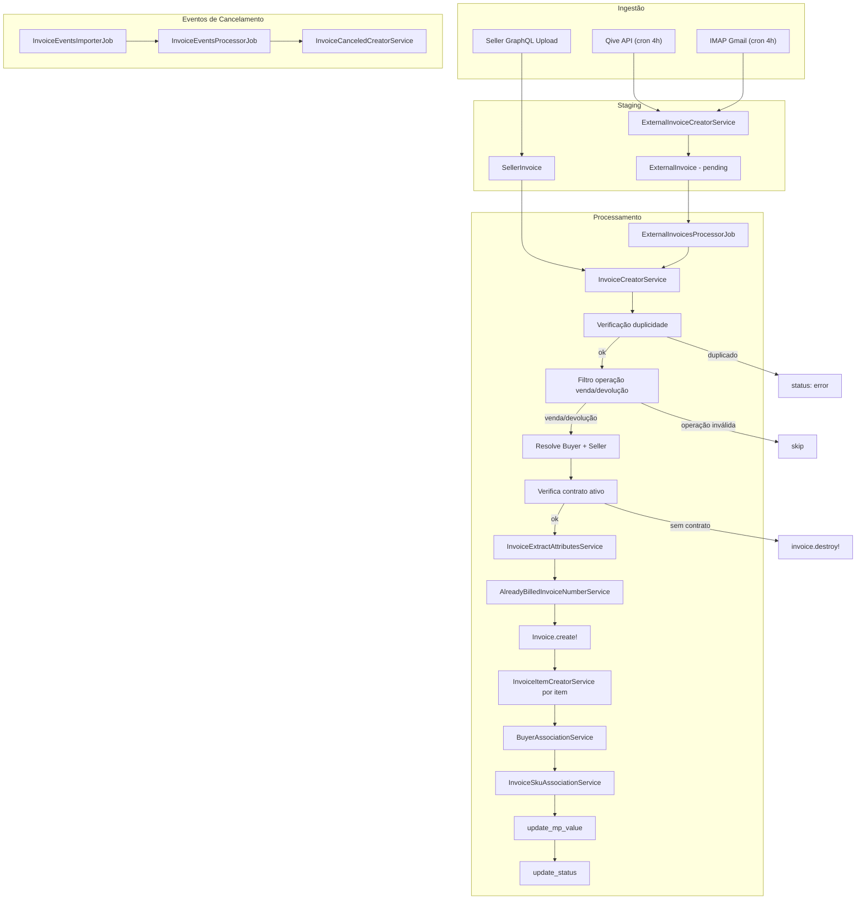
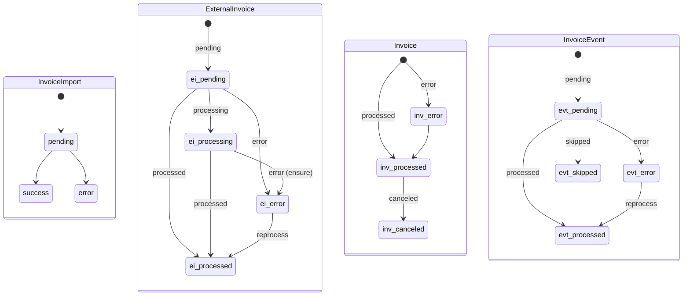

# Pipeline de Processamento de NF - finance-api

Documento técnico extraído do código-fonte de `repos/finance-api`.

Objetivo: servir de especificação para replicar o comportamento no `finance-consumer` e guiar um desenvolvimento faseado, sem perder regras, integrações, estados, erros e observabilidade.

---

## 1. Objetivo do consumo

O `finance-consumer` precisa reproduzir o pipeline completo de NF hoje existente no `finance-api`:

- importar NFs de múltiplas origens,
- persistir staging,
- processar para `Invoice` canonical,
- criar itens,
- resolver buyer e seller,
- validar contrato e duplicidade,
- aplicar lógica de SKU,
- tratar cancelamentos,
- registrar logs e estados idempotentes.

A meta é manter paridade funcional com o comportamento atual.

---

## 2. Pipeline completo de processamento da NF

### 2.1 Visão geral do fluxo

### 2.2 Sequência exata de etapas

#### Fase 1, importação, staging

1. `ExternalInvoicesImporterJob` dispara via cron.
   - Qive a cada 4h.
   - IMAP a cada 4h com offset de 20min.
2. `ExternalInvoicesImporterService#import` cria ou recupera `InvoiceImport` com `filter_start` e `filter_end`.
3. Delega para `ExternalInvoices::QiveImporter` ou `ExternalInvoices::ImapImporter`.
4. Para cada NF recebida, `ExternalInvoiceCreatorService#create`.
   - verifica duplicidade por `access_key` em `ExternalInvoice`,
   - faz parse do XML via `Utils::XmlToHash.convert`,
   - valida presença de `dest` com CNPJ do varejista,
   - faz upload do XML para S3 em `external-invoices/{access_key}.xml`,
   - extrai atributos do `infNFe`,
   - cria `ExternalInvoice` com status `pending`.
5. Ao finalizar a importação, `InvoiceImport.status = :success`.
6. Enfileira `ExternalInvoicesProcessorJob.perform_async(invoice_import.id, source)`.

#### Fase 2, processamento de `ExternalInvoice` para `Invoice`

7. `ExternalInvoicesProcessorJob` chama `ExternalInvoicesProcessorService#process`.
8. Consulta `ExternalInvoice` com:
   - `status in [pending, error, processing]`,
   - `date` do mês anterior até o fim do mês atual,
   - `operation in [venda, devolucao]`.
9. Para cada `ExternalInvoice`, chama `InvoiceCreatorService#create`.
   - a. lê XML do S3 via `AwsReaderService`, com cache por filename,
   - b. converte XML para Hash via `Utils::XmlToHash.convert`,
   - c. extrai `infNFe` via `Utils::NfeUtils.extract_inf_nfe`,
   - d. verifica duplicidade via `InvoiceVerifyDuplicationService`,
   - e. verifica `access_key` duplicada em `Invoice`,
   - f. aplica filtro de operação,
   - g. resolve `Buyer` via `BuyerService#find_or_create`,
   - h. resolve `Seller` via `SellerService#find_or_create`,
   - i. extrai atributos via `InvoiceExtractAttributesService#extract`,
   - j. verifica se já faturado via `AlreadyBilledInvoiceNumberService#exists?`,
   - k. verifica duplicidade no batch atual via `created_invoice_numbers`,
   - l. cria `Invoice.create!` com `status: :processed`,
   - m. cria `InvoiceItem` para cada `det[]`,
   - n. executa `BuyerAssociationService#associate`,
   - o. executa `InvoiceSkuAssociationService#associate`,
   - p. verifica contrato ativo entre buyer e seller,
   - q. invalida `ZeroBilling` declarado para seller e mês,
   - r. executa `invoice.update_mp_value` e `invoice.update_status`,
   - s. marca `ExternalInvoice.status = :processed`.
10. `ensure` força qualquer `ExternalInvoice` ainda em `processing` para `error`.
11. Enfileira `InvoiceEventsProcessorJob.perform_async`.

#### Fase 3, eventos de cancelamento

12. `InvoiceEventsImporterJob`, rodando 4x ao dia, chama `InvoiceEventsImporterService`.
13. Consulta Qive API:
   - `GET /events/nfe?type=110111,110112&cursor=X&limit=50`.
14. Para cada evento, `InvoiceEventCreatorService#create`.
   - salva XML no S3,
   - cria `InvoiceEvent`.
15. `InvoiceEventsProcessorJob` chama `InvoiceEventsProcessorService#process`.
16. Para cada `InvoiceEvent` com status `pending` ou `error`:
   - localiza `Invoice` por `access_key`,
   - chama `InvoiceCanceledCreatorService#create`,
   - marca invoice original como `status: :canceled`,
   - duplica invoice com valores negativos e `operation: 'cancelamento'`,
   - duplica `InvoiceItem` com sinais invertidos.

---

## 3. Condições de bifurcação

- **Fonte de importação**: Qive, IMAP ou Seller.
- **IMAP, tipo de evento**: `tpEvento` em `110111` ou `110112` segue fluxo de cancelamento, senão segue fluxo normal de NF.
- **IMAP, source por remetente**: `notificacao@grupoamicci.com.br` gera source `buyer`, demais geram `imap`.
- **Operação, CFOP**: somente `venda` e `devolucao` passam pelo processamento.
- **Devolução, atribuição buyer/seller**: se CFOP começa com `1` ou `2`, usa `assign_default` com `dest=buyer` e `emit=seller`. Caso contrário, inverte.
- **Already billed**: invoice é criada com `ignored_reason: :already_billed`, sem bloqueio.
- **Contrato inexistente**: invoice é destruída e `ExternalInvoice` vira `error`.
- **Período fechado**: `reference_date` avança para o próximo mês aberto, de forma recursiva.

---

## 4. Extração e normalização de dados

### 4.1 Parse do XML

- Parser: `Utils::XmlToHash.convert(xml, preserve_keys: true)`.
- Implementação baseada em **Nokogiri**.
- Tags duplicadas viram arrays.
- Atributos XML usam prefixo `@`.
- Keys preservam case original.
- Não existe normalização para lowercase.

### 4.2 Caminhos de extração de `infNFe`

`Utils::NfeUtils.extract_inf_nfe` tenta, nesta ordem:

1. `nfeProc.NFe.infNFe`
2. `enviNFe.NFe.infNFe`
3. `NFe.infNFe`

Se vier Array, usa o primeiro elemento.

### 4.3 Campos extraídos, ExternalInvoice, staging

| Campo destino | Path XML | Obrigatório | Transformação |
|---|---|---:|---|
| `invoice_number` | `ide.nNF` | Sim | Nenhuma |
| `date` | `ide.dhEmi` | Sim | Nenhuma, string |
| `value` | `total.ICMSTot.vNF` | Sim | Nenhuma, string |
| `delivery_date` | `ide.dhSaiEnt` | Não | Nenhuma |
| `order_number` | `compra.xPed` | Não | Só se `compra` for Hash |
| `buyer_cnpj` | `dest.CNPJ` ou `emit.CNPJ` | Sim | Troca em devolução |
| `seller_cnpj` | `emit.CNPJ` ou `dest.CNPJ` | Sim | Troca em devolução |
| `buyer_name` | `dest.xNome` ou `emit.xNome` | Não | Troca em devolução |
| `code_operation` | `det[0].prod.CFOP` | Sim | Lookup em `InvoicesCodeOperations` |
| `operation` | via CFOP | Sim | Default `venda` se CFOP não encontrado |
| `access_key` | parâmetro da API ou email | Sim | Nenhuma |

### 4.4 Campos extraídos, Invoice, canonical

| Campo destino | Path XML | Transformação |
|---|---|---|
| `invoice_number` | `ide.nNF` | Nenhuma |
| `date` | `ide.dhEmi` | `Date.strptime(str, '%Y-%m-%d')` |
| `value` | `total.ICMSTot.vNF` | `.to_f` |
| `delivery_date` | `ide.dhSaiEnt` | Nenhuma |
| `order_number` | `compra.xPed` | Só se Hash |
| `observations` | `infAdic.infCpl` + `infAdic.infAdFisco` | Junta com ` | ` |
| `uf_recipient` | `dest.enderDest.UF` | Nenhuma |
| `uf_sender` | `emit.enderEmit.UF` | Nenhuma |
| `access_key` | `ExternalInvoice.access_key` ou `infNFe.@Id` sem prefixo `NFe` | `delete_prefix('NFe')` para seller |
| `icmsdeson_discount_value` | `total.ICMSTot.vICMSDeson` | `.to_f` |
| `reference_date` | calculado | `date` ajustado para período aberto, recursivo |
| `buyer_association` | calculado | Match por CNPJ completo ou radical, 8 chars, via buyer-api |
| `code_operation` | `det[0].prod.CFOP` | Lookup em `InvoicesCodeOperations` |
| `operation` | via CFOP | Default `venda` |
| `ignored_reason` | calculado | `:already_billed`, `:invalid_operation`, `:not_ignored` |

### 4.5 Campos extraídos, InvoiceItem, por `det[]`

| Campo destino | Path XML | Transformação |
|---|---|---|
| `product_name` | `det[i].prod.xProd` | Nenhuma |
| `ean` | `det[i].prod.cEAN` | Nenhuma |
| `product_code` | `det[i].prod.cProd` | Nenhuma |
| `unit_measure` | `det[i].prod.uCom` | Nenhuma |
| `net_value` | `det[i].prod.vProd` | `.to_f.round(2)`, negativo se devolução |
| `qtde_item` | `det[i].prod.qCom` | `.to_f` |
| `unit_value` | `det[i].prod.vUnCom` | `.to_f.round(2)` |
| `desc_value` | `det[i].prod.vDesc` | `.to_f` |
| `ipi_value` | `det[i].imposto.IPI.IPITrib.vIPI` | `.to_f` |
| `icmsst_value` | `det[i].imposto.ICMS.{ICMS10,ICMS70,ICMS40}.vICMSST` | `.to_f`, primeiro não-zero |
| `icmsdeson_value` | `det[i].imposto.ICMS.{ICMS10,ICMS70,ICMS40}.vICMSDeson` | `.to_f`, primeiro não-zero |
| `fcpst_value` | `det[i].imposto.ICMS.{ICMS10,ICMS70,ICMS40}.vFCPST` | `.to_f`, primeiro não-zero |
| `bc_icms_value` | `det[i].imposto.ICMS.{ICMS10,ICMS70,ICMS40}.vBC` | `.to_f`, primeiro não-zero |
| `aliq_icms_value` | `det[i].imposto.ICMS.{ICMS10,ICMS70,ICMS40}.pICMS` | `.to_f`, primeiro não-zero |
| `icms_value` | `det[i].imposto.ICMS.{ICMS10,ICMS70,ICMS40}.vICMS` | `.to_f`, primeiro não-zero |
| `gross_value` | calculado | `net_value + ipi_value - desc_value + icmsst + fcpst - icmsdeson` |

Ordem de tentativa para ICMS, `ICMS10`, depois `ICMS70`, depois `ICMS40`. Primeiro valor positivo encontrado vence.

Para devolução, `net_value` e `gross_value` ficam negativos.

---

## 5. Regras de negócio

### 5.1 Validações

| Regra | Service | Critério | Consequência |
|---|---|---|---|
| Duplicidade `access_key`, staging | `ExternalInvoiceCreatorService` | `ExternalInvoice.exists?(access_key:)` | Skip com `{ ignored: ... }` |
| Duplicidade `access_key`, invoice | `InvoiceCreatorService` | `Invoice.exists?(access_key:)` | `ExternalInvoice.status = :error` |
| Duplicidade por chave de negócio | `InvoiceVerifyDuplicationService` | `invoice_number + date + seller_cnpj + buyer_cnpj` em `invoices` ou `sellins` | Skip |
| Duplicidade no batch | `InvoiceCreatorService` | `created_invoice_numbers.include?(number)` | Skip, exceto `already_billed` |
| `dest` ausente | `ExternalInvoiceCreatorService` | `dest` nil no XML | `{ error: 'CNPJ do varejista não pode ser encontrado' }` |
| Operação inválida | `ExternalInvoicesProcessorService` | `operation not in [venda, devolucao]` | Skip |
| Buyer não encontrado | `BuyerService` | CNPJ não existe no buyer-api | `ExternalInvoice.status = :error` |
| Seller não encontrado | `SellerService` | CNPJ não existe no seller-api | `ExternalInvoice.status = :error` |
| Contrato inexistente | `InvoiceCreatorService` | Contrato ativo ausente | `invoice.destroy!`, `ExternalInvoice.status = :error` |
| UF inválida | `Invoice` model | `uf_recipient` ou `uf_sender` fora de `ESTADOS_BR` | Validation error |
| Troca de buyer se billed | `Invoice` model | Não permite alterar `buyer_id` se `InvoiceItem` ligado a `BillingItem` billed | Validation error |

### 5.2 Critérios de rejeição

- NF com operação diferente de `venda` ou `devolucao` é ignorada.
- NF duplicada por `access_key` ou chave de negócio é ignorada ou marcada como error.
- Buyer ou seller sem cadastro gera error com mensagem.
- Sem contrato ativo, invoice é destruída.

### 5.3 Tratamento de inconsistências

- CFOP não mapeado vira operação `venda`.
- Campo `compra` não sendo Hash gera `order_number = nil`.
- Impostos ausentes retornam `0.0`.
- XML sem leitura no S3 gera error com mensagem `Nao foi possível fazer a leitura do arquivo`.
- Período fechado faz `reference_date` avançar via `PeriodStatusService`.

---

## 6. Integrações externas

### 6.1 Qive API, ingestão de NFs

- Etapa: fase 1.
- Endpoint: `GET {QIVE_API_URL}/nfe/authorized`.
- Headers:
  - `X-API-KEY`
  - `X-API-ID`
  - `Content-Type: application/json`
- Query params:
  - `cursor`
  - `limit=50`
  - `created_at[from]`
  - `created_at[to]`
- Formato das datas: `%Y-%m-%d %H:%M:%S`.
- Response:
  - `{ count, data: [{ access_key, xml (base64) }], page: { next } }`
- Paginação:
  - se `count > 49`, busca a próxima página via `cursor` em `page.next`.
- Env vars:
  - `QIVE_API_URL`
  - `QIVE_API_KEY`
  - `QIVE_API_ID`

### 6.2 Qive API, eventos de cancelamento

- Etapa: fase 3.
- Endpoint: `GET {QIVE_API_URL}/events/nfe`.
- Query params:
  - `cursor`
  - `limit=50`
  - `type=[110111,110112]`
- Response:
  - `{ data: [{ access_key, type, xml }], page: { next } }`
- Paginação igual à ingestão.

### 6.3 IMAP Gmail

- Etapa: fase 1.
- Servidor: `imap.gmail.com:993`, com SSL.
- Env vars:
  - `IMAP_USERNAME`
  - `IMAP_PASSWORD`
- Filtro:
  - emails `UNSEEN` no INBOX.
- Source por remetente:
  - `notificacao@grupoamicci.com.br` => `buyer`
  - demais => `imap`
- Filtro de ambiente:
  - produção rejeita assunto com `[TESTE]`
  - staging aceita somente `[TESTE]`
- Eventos IMAP:
  - `tpEvento` `110111` e `110112` detectados via XPath `chNFe` e `tpEvento`.

### 6.4 AWS S3

- Etapa: fase 1, upload, e fase 2, leitura.
- Upload NF XML: `external-invoices/{access_key}.xml`
- Content-Type: `application/octet-stream`
- Upload evento XML: `invoice-events/{access_key}-{event_type}.xml`
- Leitura: `AwsReaderService#read(filename:)` com presigned URLs no model.
- Env var: `S3_BUCKET`

### 6.5 buyer-api

- Etapa: fase 2, resolver buyer.
- Fluxo:
  - `BuyerDataCacheService`
  - `BuyerAdapter`
- Dados esperados:
  - CNPJ => `{ headquarter: { id, name } }`
- Também usado em:
  - `BuyerAdapter#fetch_buyer_cnpjs(external_id:)`
  - `BuyerAdapter#fetch_buyer_brands(buyer_external_id:)` para AI SKU matching.

### 6.6 seller-api

- Etapa: fase 2, resolver seller.
- Fluxo:
  - `SellerAdapter#seller_data_find_or_create(cnpj:)`
- Dados esperados:
  - CNPJ => `{ headquarter: { id, company_name, cnpj } }`

### 6.7 AI SKU identification

- Etapa: fase 2, depois do SKU match tradicional.
- Serviço: `SkuAiIdentificationService#identify_multiple_skus`.
- Condição:
  - itens sem SKU,
  - `product_name` não vazio,
  - filtragem por brands do buyer.
- Resultado:
  - `{ item_id => sku_id }`.

---

## 7. Persistência

### 7.1 Tabelas e momento de gravação

| Tabela | Momento | Dados |
|---|---|---|
| `invoice_imports` | início da fase 1 | `filter_start`, `filter_end`, `source`, `status`, `automatic` |
| `invoice_import_logs` | por página Qive ou por email IMAP | log JSON, metadata, contadores |
| `external_invoices` | fase 1, por NF importada | access_key, cnpjs, invoice_number, date, value, filename, operation, code_operation, status |
| `invoices` | fase 2, por NF processada | todos os campos do XML, buyer_id, seller_id, reference_date, source, status |
| `invoice_items` | fase 2, por item | produto, tributos, sku_id nullable |
| `invoice_events` | fase 3, por evento | access_key, event_type, filename, importable, invoice_id opcional |
| `invoice_events_imports` | fase 3, batch | cursor, next_cursor, status |
| S3 `external-invoices/` | fase 1 | XML original da NF |
| S3 `invoice-events/` | fase 3 | XML do cancelamento |

### 7.2 Formato

- Banco: PostgreSQL, schema Rails.
- Logs: JSONB em `invoice_import_logs.log` e `metadata`.
- Arquivos: XML no S3.

---

## 8. Controle de estado

### 8.1 Máquina de estados

### 8.2 Valores de enum

- `Invoice.status`
  - `error: 0`
  - `processed: 1`
  - `canceled: 2`
- `Invoice.source`
  - `seller: 0`
  - `qive: 1`
  - `imap: 2`
  - `buyer: 20`
- `Invoice.ignored_reason`
  - `not_ignored: 0`
  - `already_billed: 1`
  - `invalid_operation: 2`
- `ExternalInvoice.status`
  - `pending: 0`
  - `processing: 1`
  - `processed: 2`
  - `error: 3`
- `ExternalInvoice.source`
  - `qive: 0`
  - `imap: 10`
  - `buyer: 20`
- `ExternalInvoice.operation`
  - `venda: 'Venda'`
  - `devolucao: 'Devolucao'`
  - `compra: 'Compra'`
  - `transferencia: 'Transferencia'`
  - `outros: 'Outros'`
  - `bonificacao: 'Bonificacao'`
  - `remessa: 'Remessa'`
  - `ajuste: 'Ajuste'`
  - `entrada: 'Entrada'`
- `InvoiceImport.status`
  - `pending: 0`
  - `success: 1`
  - `error: 2`
- `InvoiceImport.source`
  - `qive: 0`
  - `imap: 10`
- `InvoiceEvent.status`
  - `pending: 0`
  - `processed: 1`
  - `error: 2`
  - `skipped: 3`
- `InvoiceImportLog.status`
  - `success: 0`
  - `ignored: 5`
  - `error: 10`

### 8.3 Idempotência

| Ponto de verificação | Mecanismo |
|---|---|
| Staging, access_key duplicada | `ExternalInvoice.exists?(access_key:)` antes de criar |
| Invoice, access_key duplicada | `Invoice.exists?(access_key:)` antes de criar |
| Invoice, chave de negócio duplicada | `InvoiceVerifyDuplicationService` em `invoices` e `sellins` |
| Batch, número duplicado | `created_invoice_numbers` em memória |
| Evento, access_key + event_type duplicado | `InvoiceEvent.find_by(access_key:, event_type:)` antes de criar |
| Cancelamento já cancelado | `Invoice.find_by(access_key:, status: :canceled)` |

---

## 9. Tratamento de erro

### 9.1 Tipos de falha

| Falha | Local | Comportamento |
|---|---|---|
| XML ilegível no S3 | `InvoiceCreatorService#fetch_invoice_data` | `ExternalInvoice.status = :error`, mensagem `Nao foi possível fazer a leitura` |
| Buyer não encontrado | `InvoiceCreatorService#fetch_buyer` | `ExternalInvoice.status = :error`, mensagem com CNPJ |
| Seller não encontrado | `InvoiceCreatorService#fetch_seller` | `ExternalInvoice.status = :error`, mensagem com CNPJ |
| Contrato inexistente | `InvoiceCreatorService#verify_contract_buyer_seller` | `invoice.destroy!`, `ExternalInvoice.status = :error` |
| Erro genérico no create | `InvoiceCreatorService#create` | `rescue StandardError`, log de erro, retorna `nil` |
| `AuthenticationRetryBackoff` | adapters buyer/seller | re-raise para Sidekiq |
| Erro Qive >= 400 | `QiveAdapter#import` | raise, job falha, Sidekiq faz retry |
| Erro de conexão IMAP | `ImapAdapter#connect` | `ConnectionError`, log error |
| Erro por email IMAP | `ImapImporter#process_email_data` | rescue por email, continua próximos |
| Processing travado | `ExternalInvoicesProcessorJob ensure` | força `ExternalInvoice.status = :error` |

### 9.2 Retry

- Sidekiq global: `max_retries: 3`.
- Jobs fazem `rescue StandardError` e `raise` para acionar retry.
- IMAP faz retry por email, sem parar o lote.
- Qive continua paginação quando a página anterior está OK.

### 9.3 Dead letter e fallback

- Não existe dead-letter queue explícita.
- Falhas após 3 retries vão para o Sidekiq Dead Set.
- `ExternalInvoice` em `error` pode ser reprocessada via `invoices#reprocess_all`.
- `InvoiceEvent` em `error` é reprocessada a cada execução do `InvoiceEventsProcessorJob`.

---

## 10. Observabilidade

### 10.1 Logs

| Etapa | Log | Nível |
|---|---|---|
| Início importação | `ExternalInvoicesImporterJob Iniciado` | info |
| Fim importação | `ExternalInvoicesImporterJob Finalizado` | info |
| Falha importação | `ExternalInvoicesImporterJob falhou: {msg}` | error |
| Início processamento | `ExternalInvoicesProcessorJob Iniciado` | info |
| Fim processamento | `ExternalInvoicesProcessorJob Finalizado` | info |
| Invoice create error | `Error creating invoice: {msg}` + backtrace + dados | error |
| Buyer não encontrado | `Buyer with CNPJ X not found` | warn |
| Seller não encontrado | `Seller with CNPJ X not found` | warn |
| Buyer criado | `Creating Buyer with CNPJ X` | info |
| Seller criado | `Creating Seller with CNPJ X` | info |
| SKU associado | `Associated invoice item #X with SKU #Y` | info |
| SKU via AI | `AI associated invoice item #X with SKU #Y` | info |
| IMAP conectado | `Conectando ao servidor IMAP` | info |
| Emails encontrados | `Encontrados X emails não lidos` | info |
| Eventos Qive | `Fetching NFe cancellation events with cursor: X` | info |
| Cancelamento error | `Error creating invoice: {msg}` | error |

### 10.2 Logs estruturados, DB

- `InvoiceImportLog.log`, JSONB:
  - `{ general: [msgs], attachments: [{ filename, status, message, access_key }] }`
- `InvoiceImportLog.metadata`, JSONB:
  - Qive: `{ received_count, success_count, error_count, ignored_count, access_keys_* }`
  - IMAP: `{ message_id, subject, date, from, files }`

### 10.3 Métricas e tracing

- Não há instrumentação OpenTelemetry, StatsD ou equivalente no código inspecionado.
- Métricas deriváveis dos logs:
  - taxa de sucesso por importação,
  - taxa de erro por fonte,
  - volume por origem,
  - volume por operação,
  - tempo entre ingestão e processamento.

---

## 11. Plano de desenvolvimento faseado

### Fase 0, base técnica

Objetivo:
- criar a base do consumer,
- definir contratos,
- preparar persistência,
- preparar filas e jobs.

Entregas:
- estrutura do módulo,
- entidades de staging,
- enums,
- migrations,
- clientes de integração,
- storage S3,
- logging base,
- sidekiq jobs vazios.

Critérios de saída:
- pipeline executa sem erro estrutural,
- entidades e estados batem com a especificação.

### Fase 1, ingestão e staging

Objetivo:
- receber NF das origens,
- validar XML,
- persistir staging,
- salvar XML no S3.

Entregas:
- importador Qive,
- importador IMAP,
- importador Seller,
- criação de `InvoiceImport`,
- criação de `ExternalInvoice`,
- logs estruturados da importação,
- detecção de `dest`,
- detecção de duplicidade por `access_key`.

Critérios de saída:
- tudo que entra vira staging idempotente,
- XML original fica persistido no bucket,
- importação fecha com status correto.

### Fase 2, processamento principal

Objetivo:
- transformar `ExternalInvoice` em `Invoice`,
- criar items,
- resolver buyer e seller,
- aplicar regras fiscais e de negócio.

Entregas:
- leitura do XML do S3,
- parse para hash,
- extração de `infNFe`,
- duplicidade por negócio,
- duplicidade em `Invoice`,
- filtro de operação,
- resolução de buyer,
- resolução de seller,
- extração completa de atributos,
- cálculo de values,
- criação de `InvoiceItem`,
- associação de buyer,
- associação de SKU,
- `update_mp_value`,
- `update_status`,
- validação de contrato,
- tratamento de `already_billed`,
- transição de status de `ExternalInvoice`.

Critérios de saída:
- o consumer gera `Invoice` canonical com paridade funcional,
- casos inválidos ficam rastreáveis,
- sem contrato, destrói invoice e marca staging como erro.

### Fase 3, cancelamento

Objetivo:
- importar eventos de cancelamento,
- persistir evento,
- cancelar invoice,
- criar cópia negativa.

Entregas:
- importador Qive de eventos,
- persistor de `InvoiceEvent`,
- leitor do XML do evento no S3,
- processor de evento,
- serviço de cancelamento,
- cópia negativa de invoice e items.

Critérios de saída:
- cancelamento idempotente,
- invoice original cancela,
- invoice nova nasce com operação `cancelamento`,
- itens têm sinais invertidos.

### Fase 4, paridade avançada

Objetivo:
- fechar lacunas sutis de comportamento.

Entregas:
- `PeriodStatusService` recursivo,
- `AlreadyBilledInvoiceNumberService`,
- `InvoiceSkuAssociationService` com fallback completo,
- AI SKU matching,
- contadores e logs finais,
- reprocessamento de erro.

Critérios de saída:
- comportamento muito próximo do `finance-api`,
- baixa divergência entre cenários reais e o novo consumer.

---

## 12. Checklist de paridade

### Ingestão

- [ ] Consumer recebe NF de pelo menos uma das fontes, Qive, IMAP ou Seller.
- [ ] XML parseado com Nokogiri-equivalent.
- [ ] `preserve_keys` ativo.
- [ ] Atributos com prefixo `@`.
- [ ] Tags duplicadas viram arrays.
- [ ] `infNFe` extraído pelos 3 paths.
- [ ] Base64 decodificado no fluxo Qive.
- [ ] `chNFe` e `tpEvento` extraídos para IMAP.

### Staging

- [ ] Duplicidade por `access_key` antes de gravar.
- [ ] Validação de `dest` presente.
- [ ] Upload XML em `external-invoices/{access_key}.xml`.
- [ ] Extrair `nNF`, `dhEmi`, `vNF`, `dhSaiEnt`, `xPed`, CNPJs, CFOP e operation.
- [ ] CFOP resolve operation via tabela.
- [ ] Swap buyer/seller em devolução.

### Processamento

- [ ] Filtro de status e período correto.
- [ ] Leitura do XML no S3 com cache.
- [ ] Duplicidade por chave de negócio.
- [ ] Duplicidade por `access_key` em `Invoice`.
- [ ] Duplicidade em batch com Set.
- [ ] Resolve buyer via buyer-api.
- [ ] Resolve seller via seller-api.
- [ ] Extrai todos os campos da seção 4.4.
- [ ] `reference_date` ajustada para período aberto.
- [ ] `buyer_association` por CNPJ completo ou radical.
- [ ] `AlreadyBilledInvoiceNumberService` aplicado.
- [ ] `Invoice.create!` com status correto.
- [ ] Cria item para cada `det[]`.
- [ ] `gross_value` calculado corretamente.
- [ ] Devolução gera valores negativos.
- [ ] ICMS tenta `ICMS10`, depois `ICMS70`, depois `ICMS40`.
- [ ] `BuyerAssociationService` reatribui buyer se necessário.
- [ ] `InvoiceSkuAssociationService` cobre match direto, fallback e AI.
- [ ] Contrato ativo validado.
- [ ] `ZeroBilling` invalidado quando necessário.
- [ ] `update_mp_value` soma itens com `sku.mp = true`.
- [ ] `update_status` reflete itens com SKU.
- [ ] `Sellin` correspondente recebe `ignored_reason: :replaced_by_invoice`.
- [ ] `ExternalInvoice.status = :processed`.

### Cancelamento

- [ ] Importa eventos Qive `110111` e `110112`.
- [ ] Cria `InvoiceEvent` idempotente.
- [ ] Upload do XML do evento em S3.
- [ ] Localiza invoice por `access_key`.
- [ ] Marca original como `canceled`.
- [ ] Duplica invoice com valores negativos.
- [ ] Duplica items com campos numéricos invertidos.
- [ ] Vincula nova invoice ao original.

### Error handling

- [ ] Sidekiq `max_retries: 3`.
- [ ] `ensure` força stuck `processing` para `error`.
- [ ] IMAP trata erro por email.
- [ ] `InvoiceEvent` em error reprocessa automaticamente.
- [ ] `ExternalInvoice` em error pode ser reprocessada via controller.

### Observabilidade

- [ ] Logs de início e fim por job.
- [ ] Logs de erro com mensagem e backtrace.
- [ ] Logs estruturados em `invoice_import_logs`.
- [ ] Metadata de email preservada para IMAP.

---

## 13. Ordem recomendada de implementação

1. Base de domínio e persistência.
2. Importação e staging.
3. Processamento principal.
4. Duplicidade e idempotência.
5. Cancelamento.
6. SKU e AI.
7. Contrato e período aberto.
8. Observabilidade.
9. Reprocessamento e hardening.
10. Validação final de paridade.

---

## 14. Resultado esperado

Ao final, o `finance-consumer` precisa ter:

- mesmo fluxo de ingestão,
- mesma regra de transformação,
- mesmo comportamento de status,
- mesma lógica de duplicidade,
- mesmo tratamento de cancelamento,
- mesmo contrato com integrações externas,
- mesma rastreabilidade operacional.

Esse arquivo serve como guia único para desenvolvimento faseado e conferência de paridade.
