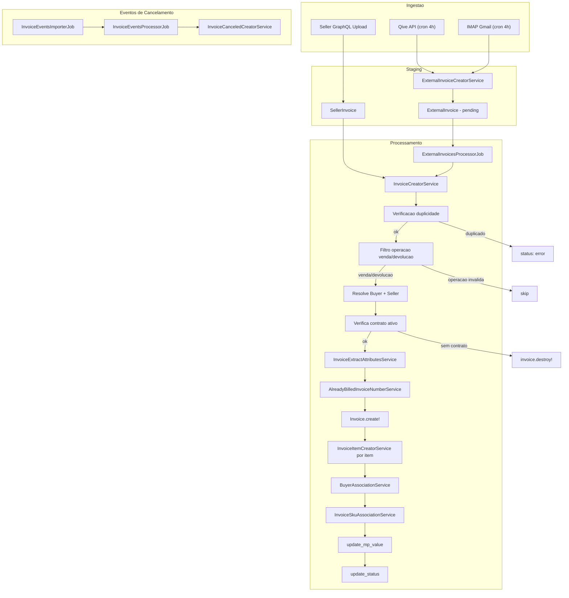
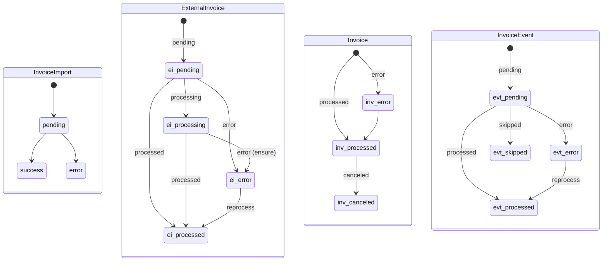

# Pipeline de Processamento de NF - finance-api

Documento tecnico extraido diretamente do codigo-fonte de `repos/finance-api`.
Objetivo: servir de especificacao para replicar o comportamento no `finance-consumer`.

---

## 1. Pipeline Completo de Processamento da NF

### 1.1 Visao Geral do Fluxo

### 1.2 Sequencia Exata de Etapas

**Fase 1 - Importacao (Staging)**

1. `ExternalInvoicesImporterJob` dispara via cron (Qive a cada 4h, IMAP a cada 4h com offset de 20min)
2. `ExternalInvoicesImporterService#import` cria/recupera `InvoiceImport` com `filter_start`/`filter_end`
3. Delega para `ExternalInvoices::QiveImporter` ou `ExternalInvoices::ImapImporter`
4. Para cada NF recebida: `ExternalInvoiceCreatorService#create`
   - Verifica duplicidade por `access_key` em `ExternalInvoice`
   - Faz parse do XML via `Utils::XmlToHash.convert`
   - Valida presenca de `dest` (CNPJ do varejista)
   - Upload XML para S3: `external-invoices/{access_key}.xml`
   - Extrai atributos do `infNFe` (nNF, dhEmi, vNF, CFOP, CNPJs)
   - Cria `ExternalInvoice` com status `pending`
5. Ao finalizar importacao: `InvoiceImport.status = :success`
6. Enfileira `ExternalInvoicesProcessorJob.perform_async(invoice_import.id, source)`

**Fase 2 - Processamento (ExternalInvoice -> Invoice)**

7. `ExternalInvoicesProcessorJob` chama `ExternalInvoicesProcessorService#process`
8. Query: `ExternalInvoice` com `status in [pending, error, processing]`, `date` no mes anterior ate fim do mes atual, `operation in [venda, devolucao]`
9. Para cada `ExternalInvoice`, chama `InvoiceCreatorService#create`:
   - a) Le XML do S3 via `AwsReaderService` (com cache por filename)
   - b) Converte XML para Hash via `Utils::XmlToHash.convert`
   - c) Extrai `infNFe` via `Utils::NfeUtils.extract_inf_nfe`
   - d) **Verificacao de duplicidade** via `InvoiceVerifyDuplicationService` (invoice_number + date + buyer_cnpj + seller_cnpj em `invoices` e `sellins`)
   - e) **Verificacao access_key** duplicada em `Invoice`
   - f) **Filtro de operacao**: somente `venda` e `devolucao`
   - g) Resolve `Buyer` via `BuyerService#find_or_create` (BuyerDataCacheService -> buyer-api)
   - h) Resolve `Seller` via `SellerService#find_or_create` (SellerAdapter -> seller-api)
   - i) Extrai atributos via `InvoiceExtractAttributesService#extract`
   - j) Verifica se ja faturado via `AlreadyBilledInvoiceNumberService#exists?`
   - k) Verifica duplicidade no batch atual via `created_invoice_numbers` (Set)
   - l) `Invoice.create!` com `status: :processed`
   - m) Cria `InvoiceItem` para cada `det[]` do XML
   - n) `BuyerAssociationService#associate` (reatribui buyer se necessario)
   - o) `InvoiceSkuAssociationService#associate` (match tradicional + AI)
   - p) Verifica contrato ativo entre buyer/seller (somente para ExternalInvoice)
   - q) Invalida `ZeroBilling` declarado para seller/mes
   - r) `invoice.update_mp_value` e `invoice.update_status`
   - s) `ExternalInvoice.status = :processed`
10. `ensure`: qualquer `ExternalInvoice` com status `processing` e forcado para `error`
11. Enfileira `InvoiceEventsProcessorJob.perform_async`

**Fase 3 - Eventos de Cancelamento**

12. `InvoiceEventsImporterJob` (cron 4x/dia) -> `InvoiceEventsImporterService`
13. Consulta Qive API: `GET /events/nfe?type=110111,110112&cursor=X&limit=50`
14. Para cada evento: `InvoiceEventCreatorService#create` (salva XML no S3, cria `InvoiceEvent`)
15. `InvoiceEventsProcessorJob` -> `InvoiceEventsProcessorService#process`
16. Para cada `InvoiceEvent` com status `pending`/`error`:
    - Localiza `Invoice` por `access_key`
    - `InvoiceCanceledCreatorService#create`:
      - Marca invoice original como `status: :canceled`
      - Duplica invoice com valores negativos e `operation: 'cancelamento'`
      - Duplica `InvoiceItem` com valores numericos invertidos

### 1.3 Condicoes de Bifurcacao

- **Fonte de importacao**: Qive (API REST paginada) vs IMAP (emails Gmail) vs Seller (GraphQL upload)
- **IMAP - tipo de evento**: se `tpEvento` in `[110111, 110112]` -> fluxo de evento de cancelamento; senao -> fluxo normal de NF
- **IMAP - source por remetente**: `notificacao@grupoamicci.com.br` -> source `buyer`; demais -> source `imap`
- **Operacao (CFOP)**: somente `venda` e `devolucao` passam pelo processamento; demais operacoes sao ignoradas
- **Devolucao - atribuicao buyer/seller**: se CFOP comeca com `1` ou `2` -> assign_default (dest=buyer, emit=seller); senao -> inverte (emit=buyer, dest=seller)
- **Already billed**: invoice e criada com `ignored_reason: :already_billed` (mas nao e bloqueada)
- **Contrato inexistente**: invoice e destruida e `ExternalInvoice` marcada como error
- **Periodo fechado**: `reference_date` e ajustada para o proximo mes aberto (recursivo)

---

## 2. Extracao e Normalizacao de Dados

### 2.1 Parse do XML

- Parser: `Utils::XmlToHash.convert(xml, preserve_keys: true)` usando **Nokogiri**
- Tags XML duplicadas viram arrays
- Atributos XML sao prefixados com `@` (ex: `@Id`)
- Keys preservam case original (nao faz lowercase)

### 2.2 Caminhos de extracao do `infNFe`

`Utils::NfeUtils.extract_inf_nfe` tenta 3 paths:
1. `nfeProc.NFe.infNFe`
2. `enviNFe.NFe.infNFe`
3. `NFe.infNFe`

Se resultado for Array, pega o primeiro elemento.

### 2.3 Campos Extraidos - ExternalInvoice (staging)

| Campo destino | Path XML | Obrigatorio | Transformacao |
|---|---|---|---|
| `invoice_number` | `ide.nNF` | Sim | Nenhuma |
| `date` | `ide.dhEmi` | Sim | Nenhuma (string) |
| `value` | `total.ICMSTot.vNF` | Sim | Nenhuma (string) |
| `delivery_date` | `ide.dhSaiEnt` | Nao | Nenhuma |
| `order_number` | `compra.xPed` | Nao | Verifica se `compra` e Hash |
| `buyer_cnpj` | `dest.CNPJ` ou `emit.CNPJ` | Sim | Swap em devolucao |
| `seller_cnpj` | `emit.CNPJ` ou `dest.CNPJ` | Sim | Swap em devolucao |
| `buyer_name` | `dest.xNome` ou `emit.xNome` | Nao | Swap em devolucao |
| `code_operation` | `det[0].prod.CFOP` | Sim | Lookup em `InvoicesCodeOperations` |
| `operation` | via CFOP | Sim | Default `'venda'` se CFOP nao encontrado |
| `access_key` | parametro da API/email | Sim | Nenhuma |

### 2.4 Campos Extraidos - Invoice (canonical)

| Campo destino | Path XML | Transformacao |
|---|---|---|
| `invoice_number` | `ide.nNF` | Nenhuma |
| `date` | `ide.dhEmi` | `Date.strptime(str, '%Y-%m-%d')` |
| `value` | `total.ICMSTot.vNF` | `.to_f` |
| `delivery_date` | `ide.dhSaiEnt` | Nenhuma |
| `order_number` | `compra.xPed` | Verifica se Hash |
| `observations` | `infAdic.infCpl` + `infAdic.infAdFisco` | Join com ` \| ` |
| `uf_recipient` | `dest.enderDest.UF` | Nenhuma |
| `uf_sender` | `emit.enderEmit.UF` | Nenhuma |
| `access_key` | `ExternalInvoice.access_key` ou `infNFe.@Id` sem prefixo `NFe` | `.delete_prefix('NFe')` para seller |
| `icmsdeson_discount_value` | `total.ICMSTot.vICMSDeson` | `.to_f` |
| `reference_date` | calculado | `date` ajustado para periodo aberto (recursivo +1 mes) |
| `buyer_association` | calculado | Match CNPJ completo ou radical (8 chars) via buyer-api |
| `code_operation` | `det[0].prod.CFOP` | Lookup `InvoicesCodeOperations` |
| `operation` | via CFOP | Default `'venda'` |
| `ignored_reason` | calculado | `:already_billed` se faturado, `:invalid_operation` se operacao invalida, `:not_ignored` caso contrario |

### 2.5 Campos Extraidos - InvoiceItem (por `det[]`)

| Campo destino | Path XML | Transformacao |
|---|---|---|
| `product_name` | `det[i].prod.xProd` | Nenhuma |
| `ean` | `det[i].prod.cEAN` | Nenhuma |
| `product_code` | `det[i].prod.cProd` | Nenhuma |
| `unit_measure` | `det[i].prod.uCom` | Nenhuma |
| `net_value` | `det[i].prod.vProd` | `.to_f.round(2)`, negativo se devolucao |
| `qtde_item` | `det[i].prod.qCom` | `.to_f` |
| `unit_value` | `det[i].prod.vUnCom` | `.to_f.round(2)` |
| `desc_value` | `det[i].prod.vDesc` | `.to_f` |
| `ipi_value` | `det[i].imposto.IPI.IPITrib.vIPI` | `.to_f` |
| `icmsst_value` | `det[i].imposto.ICMS.{ICMS10/ICMS70/ICMS40}.vICMSST` | `.to_f`, primeiro nao-zero |
| `icmsdeson_value` | `det[i].imposto.ICMS.{ICMS10/ICMS70/ICMS40}.vICMSDeson` | `.to_f`, primeiro nao-zero |
| `fcpst_value` | `det[i].imposto.ICMS.{ICMS10/ICMS70/ICMS40}.vFCPST` | `.to_f`, primeiro nao-zero |
| `bc_icms_value` | `det[i].imposto.ICMS.{ICMS10/ICMS70/ICMS40}.vBC` | `.to_f`, primeiro nao-zero |
| `aliq_icms_value` | `det[i].imposto.ICMS.{ICMS10/ICMS70/ICMS40}.pICMS` | `.to_f`, primeiro nao-zero |
| `icms_value` | `det[i].imposto.ICMS.{ICMS10/ICMS70/ICMS40}.vICMS` | `.to_f`, primeiro nao-zero |
| `gross_value` | calculado | `net_value + ipi_value - desc_value + icmsst (se > 0) + fcpst (se > 0) - icmsdeson (se > 0)` |

Tipos ICMS tentados em ordem: `ICMS10`, `ICMS70`, `ICMS40`. Primeiro valor positivo encontrado e usado.

Para **devolucao**: `net_value` e `gross_value` sao negativados.

---

## 3. Regras de Negocio

### 3.1 Validacoes

| Regra | Service | Criterio | Consequencia |
|---|---|---|---|
| **Duplicidade access_key (staging)** | `ExternalInvoiceCreatorService` | `ExternalInvoice.exists?(access_key:)` | Skip com `{ ignored: ... }` |
| **Duplicidade access_key (invoice)** | `InvoiceCreatorService` | `Invoice.exists?(access_key:)` | `ExternalInvoice.status = :error` |
| **Duplicidade por chave de negocio** | `InvoiceVerifyDuplicationService` | `invoice_number + date + seller_cnpj + buyer_cnpj` em `invoices` OU `sellins` | Skip |
| **Duplicidade no batch** | `InvoiceCreatorService` | `created_invoice_numbers.include?(number)` | Skip (exceto se already_billed) |
| **Dest ausente** | `ExternalInvoiceCreatorService` | `dest` nil no XML | `{ error: 'CNPJ do varejista nao pode ser encontrado' }` |
| **Operacao invalida** | `ExternalInvoicesProcessorService` | `operation not in [venda, devolucao]` | Skip (nao processa) |
| **Buyer nao encontrado** | `BuyerService` | CNPJ nao existe no buyer-api | `ExternalInvoice.status = :error` |
| **Seller nao encontrado** | `SellerService` | CNPJ nao existe no seller-api | `ExternalInvoice.status = :error` |
| **Contrato inexistente** | `InvoiceCreatorService` | `Contract` para buyer(+network)/seller com `end_date nil ou >= hoje` | `invoice.destroy!`, `ExternalInvoice.status = :error` |
| **UF invalida** | `Invoice` model | `uf_recipient`/`uf_sender` not in `ESTADOS_BR` | Validation error |
| **Buyer change if billed** | `Invoice` model | Nao permite alterar `buyer_id` se `InvoiceItem` vinculado a `BillingItem` billed | Validation error |

### 3.2 Criterios de Rejeicao

- NF com operacao diferente de `venda`/`devolucao`: silenciosamente ignorada
- NF duplicada (access_key ou chave de negocio): ignorada ou marcada como error
- Buyer/seller sem cadastro: error com mensagem
- Sem contrato ativo: invoice destruida

### 3.3 Tratamento de Inconsistencias

- **CFOP nao mapeado**: default para operacao `'venda'`
- **Campo `compra` nao e Hash**: `order_number` retorna `nil`
- **Impostos ausentes**: retorna `0.0` para todos os campos tributarios
- **XML sem leitura no S3**: error com mensagem "Nao foi possivel fazer a leitura do arquivo"
- **Periodo fechado**: `reference_date` avanca recursivamente para proximo mes aberto via `PeriodStatusService`

---

## 4. Integracoes Externas

### 4.1 Qive API (Ingestao de NFs)

- **Etapa**: Fase 1 - Importacao
- **Endpoint**: `GET {QIVE_API_URL}/nfe/authorized`
- **Headers**: `X-API-KEY`, `X-API-ID`, `Content-Type: application/json`
- **Query params**: `cursor`, `limit: 50`, `created_at[from]`, `created_at[to]` (formato `%Y-%m-%d %H:%M:%S`)
- **Response**: `{ count, data: [{ access_key, xml (base64) }], page: { next } }`
- **Paginacao**: se `count > 49`, busca proxima pagina via `cursor` da URL em `page.next`
- **Env vars**: `QIVE_API_URL`, `QIVE_API_KEY`, `QIVE_API_ID`

### 4.2 Qive API (Eventos de Cancelamento)

- **Etapa**: Fase 3 - Eventos
- **Endpoint**: `GET {QIVE_API_URL}/events/nfe`
- **Query params**: `cursor`, `limit: 50`, `type: [110111, 110112]`
- **Response**: `{ data: [{ access_key, type, xml }], page: { next } }`
- **Paginacao**: mesma logica de cursor

### 4.3 IMAP Gmail

- **Etapa**: Fase 1 - Importacao
- **Servidor**: `imap.gmail.com:993` (SSL)
- **Env vars**: `IMAP_USERNAME`, `IMAP_PASSWORD`
- **Filtro**: emails UNSEEN no INBOX
- **Source por remetente**: `notificacao@grupoamicci.com.br` -> source `buyer`; demais -> `imap`
- **Filtro ambiente**: producao rejeita assunto com `[TESTE]`; staging aceita somente `[TESTE]`
- **Eventos IMAP**: `tpEvento` 110111/110112 detectados via XPath `chNFe`/`tpEvento`

### 4.4 AWS S3

- **Etapa**: Fase 1 (upload) e Fase 2 (leitura)
- **Upload NF XML**: `external-invoices/{access_key}.xml` (content-type `application/octet-stream`)
- **Upload evento XML**: `invoice-events/{access_key}-{event_type}.xml`
- **Leitura**: `AwsReaderService#read(filename:)` com presigned URLs no model
- **Env var**: `S3_BUCKET`

### 4.5 buyer-api

- **Etapa**: Fase 2 - step g (resolve buyer)
- **Via**: `BuyerDataCacheService` -> `BuyerAdapter` (HTTP)
- **Dados**: CNPJ -> `{ headquarter: { id, name } }`
- **Tambem**: `BuyerAdapter#fetch_buyer_cnpjs(external_id:)` para buyer_association
- **Tambem**: `BuyerAdapter#fetch_buyer_brands(buyer_external_id:)` para AI SKU matching

### 4.6 seller-api

- **Etapa**: Fase 2 - step h (resolve seller)
- **Via**: `SellerAdapter#seller_data_find_or_create(cnpj:)`
- **Dados**: CNPJ -> `{ headquarter: { id, company_name, cnpj } }`

### 4.7 AI SKU Identification

- **Etapa**: Fase 2 - step o (apos SKU match tradicional)
- **Via**: `SkuAiIdentificationService#identify_multiple_skus`
- **Condicao**: apenas itens sem SKU, com `product_name` nao vazio, filtrados por brands do buyer
- **Resultado**: `{ item_id => sku_id }`

---

## 5. Persistencia

### 5.1 Tabelas e Momento de Gravacao

| Tabela | Momento | Dados |
|---|---|---|
| `invoice_imports` | Inicio da Fase 1 | Batch metadata: `filter_start`, `filter_end`, `source`, `status`, `automatic` |
| `invoice_import_logs` | Por pagina Qive ou por email IMAP | Log JSON (`general`, `attachments`), metadata (`message_id`, `subject`, `access_keys_*`, `counts`) |
| `external_invoices` | Fase 1 - por NF importada | Staging: access_key, cnpjs, invoice_number, date, value, filename (S3 path), operation, code_operation, status |
| `invoices` | Fase 2 - por NF processada | Canonico: todos os campos extraidos do XML + buyer_id, seller_id, reference_date, source, status |
| `invoice_items` | Fase 2 - por item da NF | Produto + tributos + sku_id (nullable) |
| `invoice_events` | Fase 3 - por evento importado | access_key, event_type, filename (S3 path), importable (polymorphic), invoice_id (optional) |
| `invoice_events_imports` | Fase 3 - batch de eventos | cursor, next_cursor, status |
| S3 `external-invoices/` | Fase 1 | XML original da NF |
| S3 `invoice-events/` | Fase 3 | XML do evento de cancelamento |

### 5.2 Formato

- Banco: PostgreSQL (schema Rails)
- Logs: JSONB (`invoice_import_logs.log` e `.metadata`)
- Arquivos: XML no S3

---

## 6. Controle de Estado

### 6.1 Maquina de Estados

### 6.2 Valores de Enum

- **`Invoice.status`**: `error: 0`, `processed: 1`, `canceled: 2`
- **`Invoice.source`**: `seller: 0`, `qive: 1`, `imap: 2`, `buyer: 20`
- **`Invoice.ignored_reason`**: `not_ignored: 0`, `already_billed: 1`, `invalid_operation: 2`
- **`ExternalInvoice.status`**: `pending: 0`, `processing: 1`, `processed: 2`, `error: 3`
- **`ExternalInvoice.source`**: `qive: 0`, `imap: 10`, `buyer: 20`
- **`ExternalInvoice.operation`**: `venda: 'Venda'`, `devolucao: 'Devolucao'`, `compra: 'Compra'`, `transferencia: 'Transferencia'`, `outros: 'Outros'`, `bonificacao: 'Bonificacao'`, `remessa: 'Remessa'`, `ajuste: 'Ajuste'`, `entrada: 'Entrada'`
- **`InvoiceImport.status`**: `pending: 0`, `success: 1`, `error: 2`
- **`InvoiceImport.source`**: `qive: 0`, `imap: 10`
- **`InvoiceEvent.status`**: `pending: 0`, `processed: 1`, `error: 2`, `skipped: 3`
- **`InvoiceImportLog.status`**: `success: 0`, `ignored: 5`, `error: 10`

### 6.3 Idempotencia

| Ponto de verificacao | Mecanismo |
|---|---|
| Staging: access_key duplicada | `ExternalInvoice.exists?(access_key:)` antes de criar |
| Invoice: access_key duplicada | `Invoice.exists?(access_key:)` antes de criar |
| Invoice: chave de negocio duplicada | `InvoiceVerifyDuplicationService` (number + date + cnpjs) em `invoices` e `sellins` |
| Batch: numero duplicado no lote | `created_invoice_numbers` Set in-memory |
| Evento: access_key + event_type duplicado | `InvoiceEvent.find_by(access_key:, event_type:)` antes de criar |
| Cancelamento: ja cancelado | `Invoice.find_by(access_key:, status: :canceled)` |

---

## 7. Tratamento de Erro

### 7.1 Tipos de Falha

| Falha | Local | Comportamento |
|---|---|---|
| XML ilegivel no S3 | `InvoiceCreatorService#fetch_invoice_data` | `ExternalInvoice.status = :error`, msg "Nao foi possivel fazer a leitura" |
| Buyer nao encontrado | `InvoiceCreatorService#fetch_buyer` | `ExternalInvoice.status = :error`, msg "Varejista com CNPJ X nao reconhecido" |
| Seller nao encontrado | `InvoiceCreatorService#fetch_seller` | `ExternalInvoice.status = :error`, msg "Industria com CNPJ X nao encontrada" |
| Contrato inexistente | `InvoiceCreatorService#verify_contract_buyer_seller` | Invoice destruida, `ExternalInvoice.status = :error` |
| Erro generico no create | `InvoiceCreatorService#create` | `rescue StandardError`, log error, retorna nil |
| AuthenticationRetryBackoff | Adapters (buyer/seller) | Re-raise para Sidekiq (retry) |
| Qive API erro >= 400 | `QiveAdapter#import` | Raise, job falha e Sidekiq faz retry |
| IMAP connection error | `ImapAdapter#connect` | `ConnectionError`, log error |
| Per-email IMAP error | `ImapImporter#process_email_data` | Rescue por email, continua para proximos |
| Stuck processing | `ExternalInvoicesProcessorJob ensure` | Forca `ExternalInvoice.status = :error` |

### 7.2 Retry

- **Sidekiq global**: `max_retries: 3` (config/sidekiq.yml)
- Jobs fazem `rescue StandardError` + `raise` para acionar retry do Sidekiq
- IMAP: retry por email (continue para proximos)
- Qive: paginacao continua mesmo se pagina anterior OK

### 7.3 Dead Letter / Fallback

- Sem dead-letter queue explicita. Falhas apos 3 retries vao para o Sidekiq Dead Set.
- `ExternalInvoice` com status `error` pode ser reprocessada via `invoices#reprocess_all` (controller)
- `InvoiceEvent` com status `error` e reprocessada a cada execucao do `InvoiceEventsProcessorJob`

---

## 8. Observabilidade

### 8.1 Logs

| Etapa | Log | Nivel |
|---|---|---|
| Inicio importacao | "ExternalInvoicesImporterJob Iniciado" | info |
| Fim importacao | "ExternalInvoicesImporterJob Finalizado" | info |
| Falha importacao | "ExternalInvoicesImporterJob falhou: {msg}" | error |
| Inicio processamento | "ExternalInvoicesProcessorJob Iniciado" | info |
| Fim processamento | "ExternalInvoicesProcessorJob Finalizado" | info |
| Invoice create error | "Error creating invoice: {msg}" + backtrace + dados | error |
| Buyer nao encontrado | "Buyer with CNPJ X not found" | warn |
| Seller nao encontrado | "Seller with CNPJ X not found" | warn |
| Buyer criado | "Creating Buyer with CNPJ X" | info |
| Seller criado | "Creating Seller with CNPJ X" | info |
| SKU associado | "Associated invoice item #X with SKU #Y" | info |
| SKU via AI | "AI associated invoice item #X with SKU #Y" | info |
| IMAP conectado | "Conectando ao servidor IMAP" | info |
| Emails encontrados | "Encontrados X emails nao lidos" | info |
| Eventos Qive | "Fetching NFe cancellation events with cursor: X" | info |
| Cancelamento error | "Error creating invoice: {msg}" | error |

### 8.2 Logs Estruturados (DB)

- `InvoiceImportLog.log` (JSONB): `{ general: [msgs], attachments: [{ filename, status, message, access_key }] }`
- `InvoiceImportLog.metadata` (JSONB): `{ received_count, success_count, error_count, ignored_count, access_keys_* }` (Qive) ou `{ message_id, subject, date, from, files }` (IMAP)

### 8.3 Metricas e Tracing

- Nao ha instrumentacao OpenTelemetry, StatsD ou equivalente no codigo inspecionado
- Metricas derivaveis dos logs estruturados: taxa de sucesso/erro por importacao, volume por fonte

---

## 9. Checklist de Paridade

### Ingestao

- [ ] Consumer recebe NF de pelo menos uma das fontes (Qive/IMAP/Seller) ou de uma fila equivalente
- [ ] XML e parseado com Nokogiri-equivalent (preserve_keys, attributes prefixed com `@`, duplicates como arrays)
- [ ] `infNFe` extraido pelos 3 paths: `nfeProc.NFe.infNFe`, `enviNFe.NFe.infNFe`, `NFe.infNFe`
- [ ] Decodificacao base64 do XML (Qive)
- [ ] Extracao de `chNFe` / `tpEvento` via XPath para IMAP

### Staging

- [ ] Duplicidade por `access_key` antes de gravar staging
- [ ] Validacao de `dest` presente no XML
- [ ] Upload XML para S3 em `external-invoices/{access_key}.xml`
- [ ] Campos extraidos: `nNF`, `dhEmi`, `vNF`, `dhSaiEnt`, `compra.xPed`, CNPJs, CFOP, operation
- [ ] CFOP -> operation via tabela `InvoicesCodeOperations` (default `venda`)
- [ ] Swap buyer/seller em devolucao (CFOP com prefixo `1`/`2` = default; demais = inverte)

### Processamento

- [ ] Filtro: somente `venda` e `devolucao`, status `pending`/`error`/`processing`, date no range mes anterior ate fim do mes atual
- [ ] Leitura XML do S3 com cache por filename
- [ ] Duplicidade: `invoice_number + date + seller_cnpj + buyer_cnpj` em `invoices` E `sellins`
- [ ] Duplicidade: `access_key` em `Invoice`
- [ ] Duplicidade: `invoice_number` no batch atual (Set in-memory)
- [ ] Resolve Buyer via buyer-api (CNPJ -> external_id -> find_or_create)
- [ ] Resolve Seller via seller-api (CNPJ -> external_id -> find_or_create)
- [ ] Extrai todos os campos de `InvoiceExtractAttributesService` (ver secao 2.4)
- [ ] `reference_date` ajustado para periodo aberto (PeriodStatusService recursivo)
- [ ] `buyer_association`: match CNPJ completo ou radical (8 chars)
- [ ] Verifica `AlreadyBilledInvoiceNumberService` (InvoiceItem + ManualBillingItem + Sellin em BillingItem billed)
- [ ] `Invoice.create!` com `status: :processed` (ou `:already_billed` se already billed)
- [ ] Cria `InvoiceItem` para cada `det[]` com todos os campos tributarios
- [ ] gross_value = `net_value + ipi - desc + icmsst(se>0) + fcpst(se>0) - icmsdeson(se>0)`
- [ ] Valores negativados para devolucao (`net_value`, `gross_value`)
- [ ] ICMS extraido de `ICMS10`, `ICMS70`, `ICMS40` (primeiro nao-zero)
- [ ] `BuyerAssociationService` reatribui buyer se necessario
- [ ] `InvoiceSkuAssociationService`: match por `ean/dun/edi_code`, fallback por `product_code` (12 meses), fallback por AI (com filtro de brand)
- [ ] Verifica contrato ativo (buyer + network buyers + seller, end_date nil ou >= hoje)
- [ ] Invalida `ZeroBilling` declarado para seller/mes
- [ ] `update_mp_value`: soma `net_value` e `gross_value` de items com `sku.mp = true`
- [ ] `update_status`: `processed` se todos os items tem `sku_id`
- [ ] Marca `Sellin` matching como `ignored_reason: :replaced_by_invoice` (path seller)
- [ ] `ExternalInvoice.status = :processed` ao final

### Cancelamento

- [ ] Importa eventos Qive tipo `110111`/`110112`
- [ ] Cria `InvoiceEvent` com access_key + event_type (idempotente)
- [ ] Upload XML evento para S3 em `invoice-events/{access_key}-{event_type}.xml`
- [ ] Localiza invoice por `access_key`, marca como `canceled`
- [ ] Duplica invoice com valores negativos e `operation: 'cancelamento'`
- [ ] Duplica items com campos numericos invertidos (`unit_value, net_value, gross_value, icmsst_value, ipi_value, desc_value, icmsdeson_value`)
- [ ] Vincula nova invoice ao `ExternalInvoice`/`SellerInvoice` original

### Error Handling

- [ ] Sidekiq max_retries: 3
- [ ] `ensure` forca `ExternalInvoice` stuck em `processing` para `error`
- [ ] Per-email rescue no IMAP (continua para proximos)
- [ ] `InvoiceEvent` com status `error` e reprocessada automaticamente
- [ ] `ExternalInvoice` com status `error` pode ser reprocessada via controller

### Observabilidade

- [ ] Logs de inicio/fim por job
- [ ] Logs de erro com mensagem e backtrace
- [ ] Logs estruturados em `invoice_import_logs` (JSONB) com contadores e access_keys
- [ ] Metadata de email (message_id, subject, date, from, files) para IMAP
